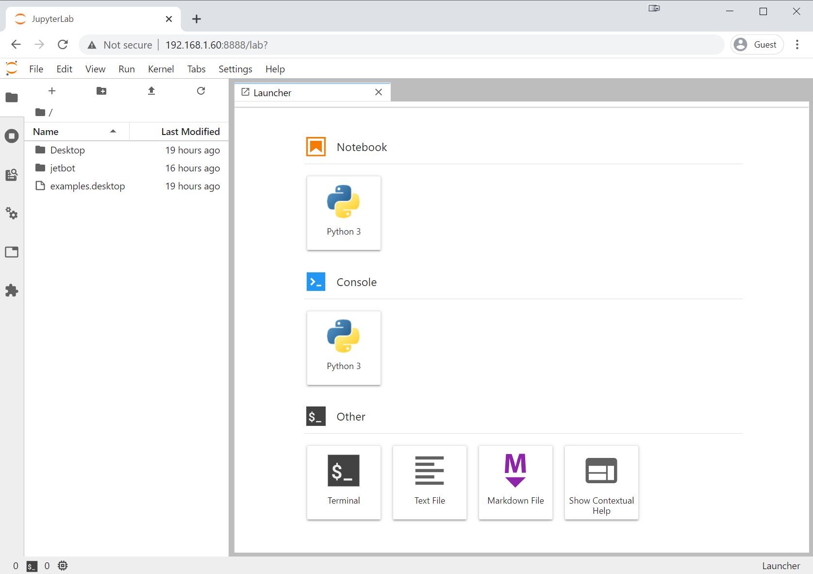

# How to connect Jetbot to a computer

### Installing OS

If the Jetbot has the OS already installed on the SD card and configured you can skip this part.
If not click on the drop down menu below and follow the steps.

<details>
<summary> How to install OS and flash it onto SD card </summary>
<br> 

### Step 1

Go to the [Jetbot doc site](https://jetbot.org/master/software_setup/sd_card.html) and the Jetbot SD card image. The Jetbot for our project has the Jetson Nano (4GB) so make sure you choose the correct download file. 

### Step 2 

1. Insert an SD card into your desktop machine

2. Using [Etcher](https://www.balena.io/etcher/), select the image you downloaded above and flash it onto the SD card.

3. Remove the SD card from your desktop machine

</details>

### Boot Jetson Nano 

1. Insert the SD card into your Jetson Nano (the micro SD card slot is located 
   under the module)

2. Connect the monitor, keyboard, and mouse to the Nano

3. Power on the Jetson Nano by connecting the micro USB charger to the port

### Connecting to Wifi

Next you'll need to connect to WiFi.

1. Log in using the user ``drawbot`` and password ``Drawbotteam01``.
   If you're doing this off a fresh install the user is ``jetbot`` and password ``jetbot``.

    
2. Connect to a WiFi network using the following command

    ```bash
    sudo nmcli device wifi connect <SSID> password <PASSWORD>
    ```

Your Jetson Nano should now automatically connect to the WiFi at boot and display it's IP address on the piOLED display.

### Connect to Jetbot using browser

1. Shutdown JetBot using the command line

    ```bash
    sudo shutdown now
    ```

2. Unplug your HDMI monitor, USB keyboard, mouse and power supply from Jetson Nano

3. Power the JetBot from the USB battery pack by plugging in the micro-USB cable

4. Wait a bit for JetBot to boot

5. Check the IP address of your robot on the *piOLED* display screen.  Enter this in place of ``<jetbot_ip_address>`` in the next command

6. Navigate to ``http://<jetbot_ip_address>:8888`` from your desktop's web browser. You can do this from any machine on your local network.  

7. Sign in using the password ``Drawbotteam01`` (if that doesn't work try ``jetbot``).

You will be presented with a view similar to the following. 



From this point on, when you power on the JetBot, it should automatically connect to WiFi and display it's IP address.  So all you need to do is reconnect using your web browser to start programming!

