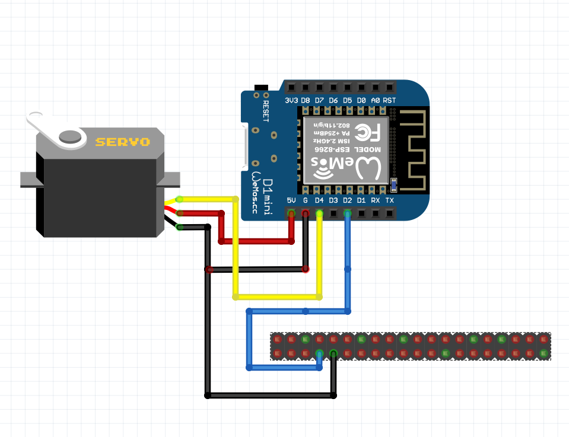

# Servo on the Jetson Nano

In this documentation we will explain how we went about trying to get a servo working on the Jetson Nano, where we looked, 
what we found, what we ended up doing and the conclusion we came to. 

## Using the Wemos D1 to Control the servo according to a signal from the Jetson Nano. 

We use a Wemos D1 mini to control the servo while it receives a signal from the Jetson Nano. In our use case we only need the servo to switch between 2 states. So we came to the conclusion that 1 pin signal is enough since if we switch the signal from positive to negative thats 2 states and that fulfills our requirement. We used the GPIO pin to send a signal to the Wemos. For an explination on how we used the GPIO pins go to [Jetson GPIO pins.](documentation/control_jetson_gpio-pins.md) 

On the Wemos we used the following code 

```cpp
#define COMMAND_PIN D2
#define SERVO_PIN D4
#include <Servo.h>
Servo servo;

// the setup routine runs once when you press reset:
void setup() {
  Serial.begin(115200);
  pinMode(COMMAND_PIN, INPUT_PULLUP);
  servo.attach(SERVO_PIN);
}

// the loop routine runs over and over again forever:
void loop() {
  // read the input pin:
  int inputState = digitalRead(COMMAND_PIN);
  // print out the state of the servo:
  Serial.println(inputState);
  if(inputState == HIGH){
    servo.write(180);
    delay(1000);
  } else if(inputState == LOW){
    servo.write(0);
    delay(1000);
    } 
}
```

As you can see we assign pin D2 on the servo to the pin from the Jetson Nano so essentially its the input pin. While we assign pin D4 to the servo to control it. 
We then setup the input pin as a pullup so that we can get a consistent reading. We then print out the state for debugging purposes and we make a if statement for it to check weather the pin is on high or low and move the servo accordingly. 

For the Jetson nano side we made a class to control the pin.

```python
import RPi.GPIO as GPIO
import time   
class PenServo:
    
    def __init__(self, pin):
        self.pin = pin
        # Optional cleanup which resets GPIO states
        GPIO.setmode(GPIO.BOARD)
        GPIO.cleanup(pin)
        # Setup
        GPIO.setup(pin,GPIO.OUT)
        self.is_up = True
        
    def up(self, delay = 0):
        GPIO.output(self.pin,True)
        time.sleep(delay)
        self.is_up = True
        
    def down(self, delay = 0):
        GPIO.output(self.pin,False)
        time.sleep(delay)
        self.is_up = False
```

For an explication on how it works you can go again to our documentation on [Jetson GPIO pins.](documentation/control_jetson_gpio-pins.md) 

The wiring diagram is: 




## Failed Attempt 1: Connecting servo directly to Jetson Nano

Initially we tried to connect the servo directly to the Jetson nano. After some research we found a few ways to do it. 
The first way was to turn on one of the PWM pins on the Jetson nano which do exist but they are disabled by default. 
The second method was to use the PCA9685 PWM module which is a module for adding servos to an embedded device if you 
lack PWMs or if you just want more than you currently have. 

We tried to turn on the PWMs pins by configuring the Jetson expansion headers using with the method on the
[nvidia Jetson nano documentation](https://docs.nvidia.com/jetson/archives/r35.1/DeveloperGuide/text/HR/ConfiguringTheJetsonExpansionHeaders.html). 

This didn't work and every time we tried to run the jetson-io.py file we would get an error. 
We tried to attempt to change the files ourselves without running the file, but we didn't get it working. 
After 2 days of tinkering with it, we came to the conclusion that because of the custom OS of the Jetbot 
we lacked certain directories/dependencies to get it to work, so we moved on to the next method.
gave up and tried the next method. 

Here are some sources we tried using that didn't fix our problem but did provide a lot of guidance:

[Jetson Nano Developer Kit User Guide](https://developer.nvidia.com/embedded/downloads#?search=Jetson%20Nano%20Developer%20Kit%20User%20Guide)

<iframe width="280" height="160" 
src="https://www.youtube.com/embed/eImDQ0PVu2Y" 
title="YouTube video player" frameborder="0" allow="accelerometer;
autoplay; clipboard-write; encrypted-media; gyroscope; picture-in-picture" allowfullscreen></iframe>

## Failed Attempt 2: Connecting the servo to the Jetson Nano using a PCA9686 PWM module

After our first failed attempt we ordered the module and tried running it with the Jetson Nano. 
We ran into 2 major problems with this module. 

The first one was that we got errors caused by the python version we were using. We thought about updating it but because we were using TensorRT and it needed other libraries and dependencies tp be a certain version or release which meant we couldn't just randomly update the python version. 

When we tested the I2C connection to the PCA9686 we got a response and confirmed that the Jetson was able to see it. We downloaded circuit python to use the adafruit-servokit library. But here we got the errors related to the python versions and we couldn't find a feasible solution. We also had problems related to the GPIO rules, to control the permissions we needed to adjust the gpio rules files but that file wasn't there with our version of the OS. So we ended up scraping this idea and decided to use a Wemos D1 mini to control the servo.

Here are some sources we tried using that didn't fix our problem but did provide a lot of guidance:

[Circuit Python Guide](https://learn.adafruit.com/circuitpython-libraries-on-linux-and-the-nvidia-jetson-nano/initial-setup)

[https://github.com/JetsonHacksNano/ServoKit](https://github.com/JetsonHacksNano/ServoKit)

<iframe width="280" height="160" 
src="https://www.youtube.com/embed/RnGUTny1hG8" 
title="YouTube video player" frameborder="0" allow="accelerometer;
autoplay; clipboard-write; encrypted-media; gyroscope; picture-in-picture" allowfullscreen></iframe>

<iframe width="280" height="160" 
src="https://www.youtube.com/embed/28Hj8if8fNY" 
title="YouTube video player" frameborder="0" allow="accelerometer;
autoplay; clipboard-write; encrypted-media; gyroscope; picture-in-picture" allowfullscreen></iframe>

<iframe width="280" height="160" 
src="https://www.youtube.com/embed/8YKAtpPSEOk" 
title="YouTube video player" frameborder="0" allow="accelerometer;
autoplay; clipboard-write; encrypted-media; gyroscope; picture-in-picture" allowfullscreen></iframe>

