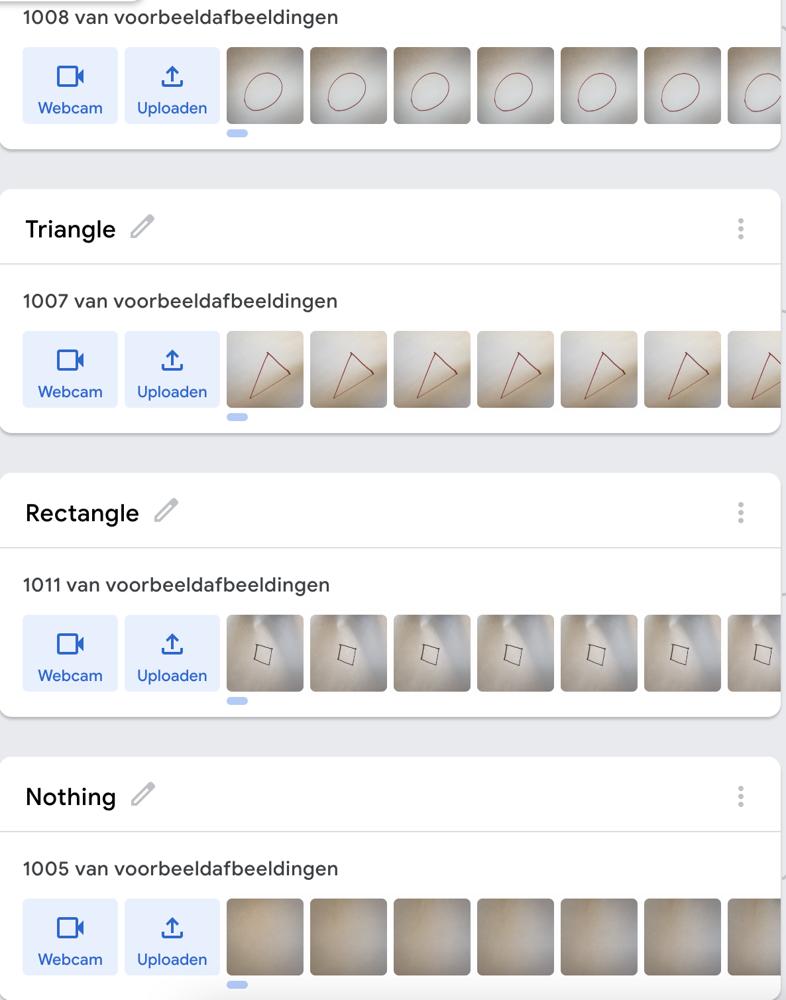
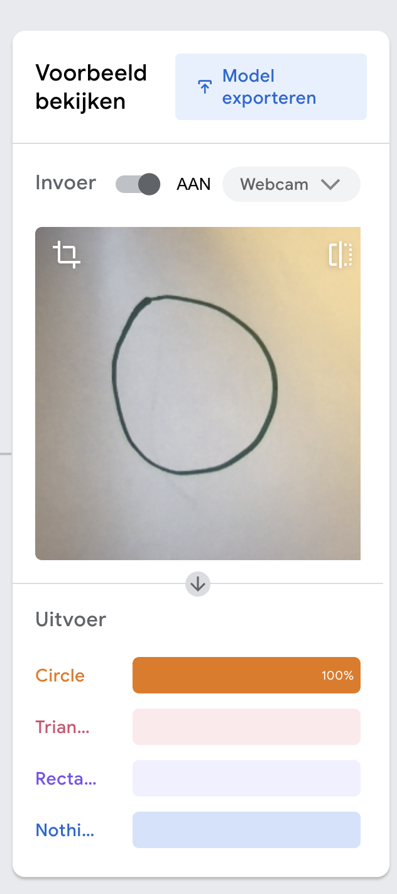

# Enhancing the object detection

We noticed the Drawbot wasn't good enough at detecting shapes when we were using opencv. That is why we made the
decision to switch to machine learning and train our drawbot to detect the shapes ourselves.

We are using [Teachable Machine](https://teachablemachine.withgoogle.com/) to train our shape detection model. We added
around 1000 pictures for each shape. We devided the shapes into 4 categories, circles, rectangles, triangles and
nothing. 
Our model is now able to detect all 4 shapes pretty well.

