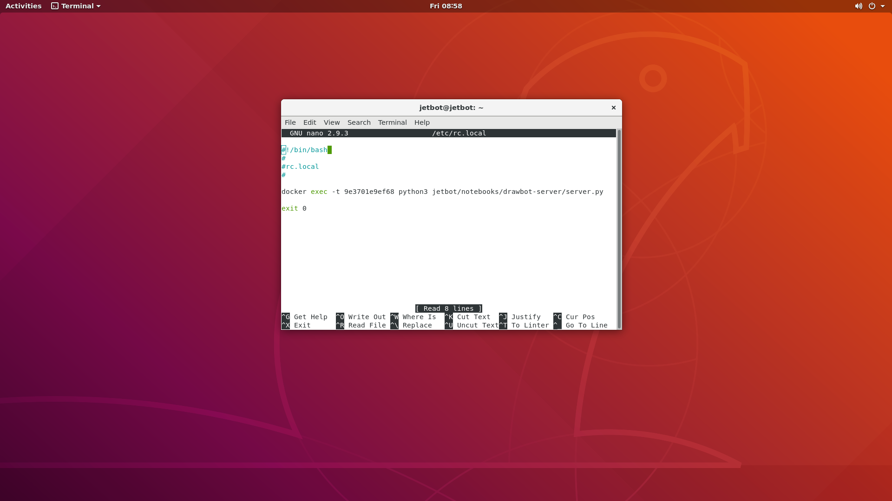
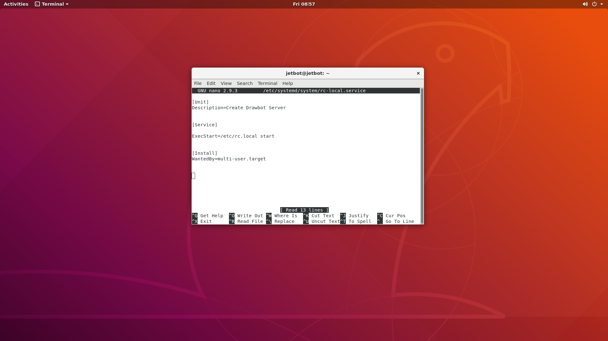

# Jetbot Configuration

## Hotspot configuration

To configure the hotspot, you should download the create_ap library from
this [link](https://github.com/oblique/create_ap).
Once it's downloaded, extract the files and start the terminal in the extracted file.
Now, we need to configure the SSID and the password of the hotspot, by editing the create_.ap.conf within the extracted
file.
Thereafter, execute the following commands in your terminal ```cd create_ap```  &#8594 ```make install```

To make the hotspot start on boot, execute this command:

``` bash 
systemctl enable create_ap
```

## Flask server on boot up

To configure a service on boot, we should firstly edit the following files:

1. rc-local.service
2. rc.local

First, we need to configure the rc.local as follows:


And the rc-local.service as follows:


Eventually, executing the following command to have the server up and running once the Jetbot is booted up:

```bash
sudo systemctl enable rc-local.service 
```
