### Sprint 1

In this documentation file we will explain how we made the pen holder extension for the JetBot. First we downloaded the original JetBot files from their [markdown page](https://jetbot.org/master/bill_of_materials.html) and loaded them into Fusion360 and Tinkercad. Because we did not yet know which software we were going to use we tried both. As Fusion360 is the most elaborate program we thought that would be the best option. The only downside of Fusion360 is that there is a big learning curve to learn the functions required to make the design. The downside of Tinkercad is that you can only create basic shapes. We divided the programs between two of the teammates and the person who was working with Tinkercad soon found out that creating a design with Tinkercad worked perfect. So we continued with that. 

After loading the original files into the program we discussed how we were going to attach a pen to the previously researched best location in between the wheels of the Bot. We soon found out that it was far too difficult to place the pen exactly in the middle because we then had to move the Jetson Nano and the battery. So we concluded that we would move the camera mount further to the front and place the pen behind it in front of the robot. Here is an image with a rough sketch of how we wanted it to turn out.

{width=900}

What we did in this step is load in 2 camera mounts. With one we chopped off the top and with the other we chopped off the bottom so we could rotate the mount. We knew we wanted no limitations in what kinds of writing material we could use so we made a practice pen (the invisible cilinder you see) 2cm in diameter. From this we knew how far we needed to place the camera mount. 

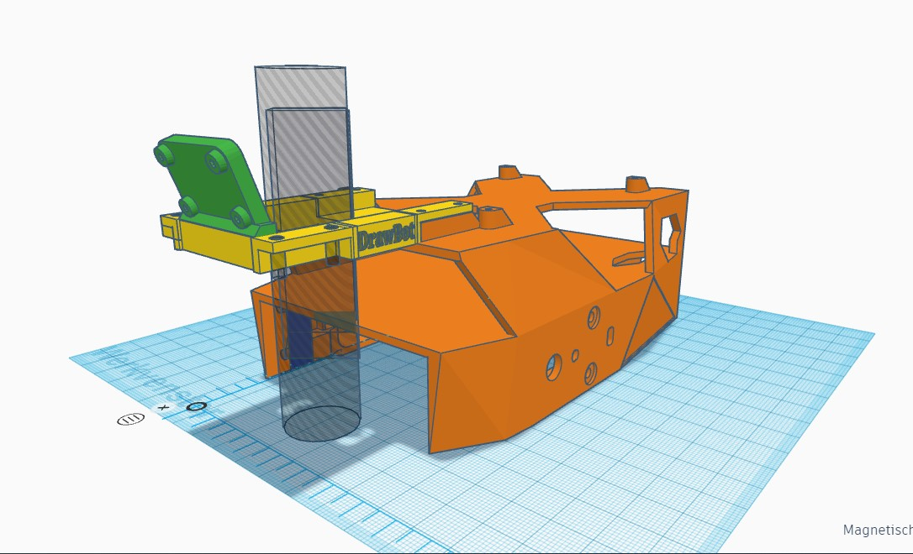

In the image above you can see how we attached the extension to the JetBot. We did this by loading in another camera mount and bridging the gap between those two with a box section. For added detail we put the text "DrawBot" on there. After that we filled in the space between those box sections and made a circular hole to fit the marker in. This was a 2cm diameter hole, this because the biggest marker is about that size so there would not be any restrictions. When that hole was created we started thinking of ways to fasten the marker on the design. We quickly came up with a system where two triangular cutouts could keep the marker in place after which a bolt of some sort could be tightened to squeeze against the marker to stop it from sliding out. These triangular cutouts are also useful when you want to install a different size pencil because the smaller the pencil the further it would get to the tip of the triangle.

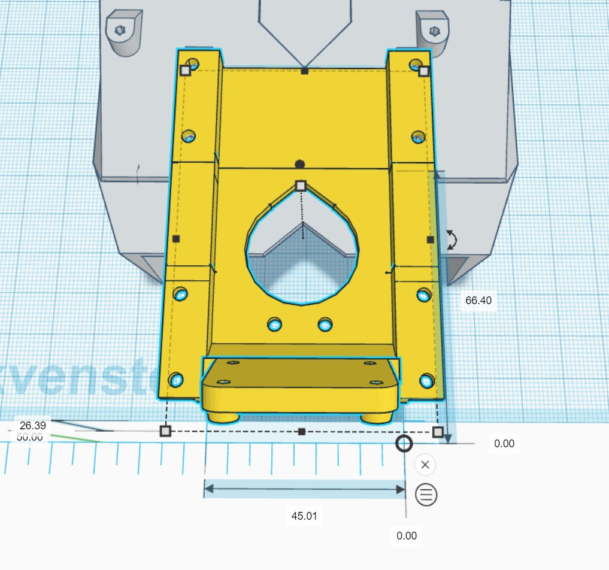

Then we needed to make sure the whole design would not wiggle so the pen could not skip around on the paper. To achieve this we made use of 4 existing holes on the bottom of the JetBot and attached diagonal supports to it. We wanted these to resemble the structure of the JetBot which meant a lot of diagonal angles. This was a bit of a challenge to make in Tinkercad because of the limitation to normal shapes. But with some messing around we managed to get the supports diagonal from the side and from the front. 

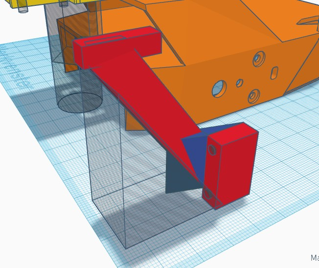{width=400}
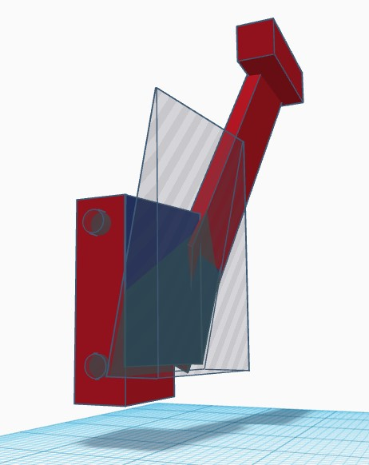{width=400}

In the images above you can see one of the legs that holds the camera mount steady. We made this by rotating a rectangular beam about 45 degrees and then attach it to two triangular shapes (blue bits). Aftre this we cut away the excess material by combining the support with two triangular holes as seen in the image. We copied and rotated one leg to fit on the other side. This in how the supports turned out.

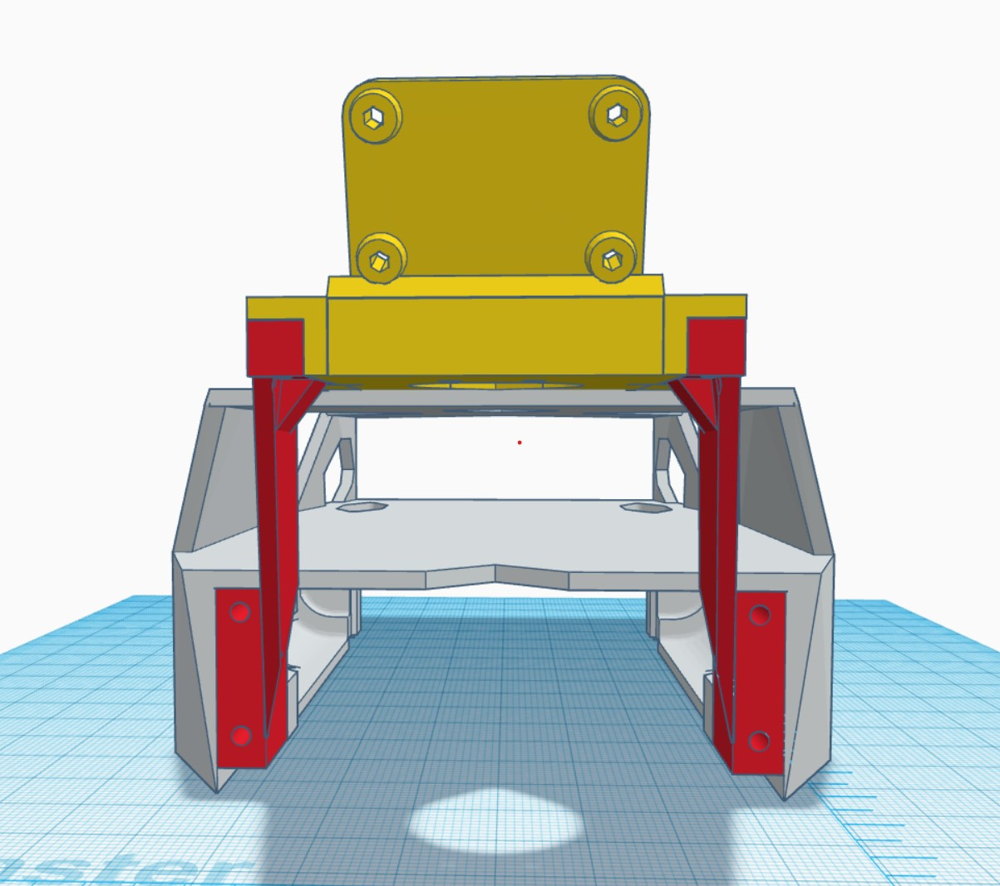{width=400}
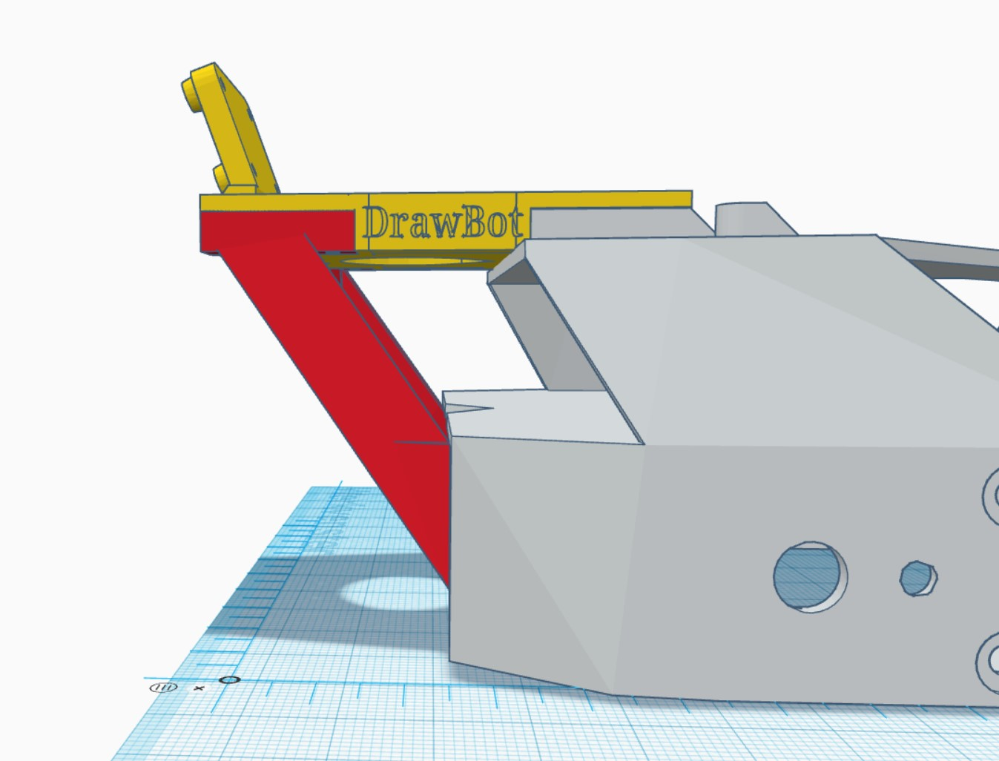{width=400}

Lastly we needed to figure out a way to attach the bolt which squeezes against the marker. At first we wanted to make a hole just underneath where the camera sits but we came to the conslusion that the bolt would only press the marker against the top triangle and it would wiggle freely on te bottom triangle. So we made a little underhang with a hole big enough for the bolt and attached it using screws. Unfortunatly the first design we made was not big enough to put the bolt through and still be able to twist it with your fingers so we had to make it bigger. 

We made the wedge bigger to be more sturdy and so it could fit an M5 bolt. We decided that the M5 bolt should be a hex bolt because of the relatively smaller head. The only dwonside of a hex bolt is that its head is round so you would not be able to grip it to twist is. To resolve this we made a slide-over system that would make the hex bolt easier to twist. These can be seen in the image below.

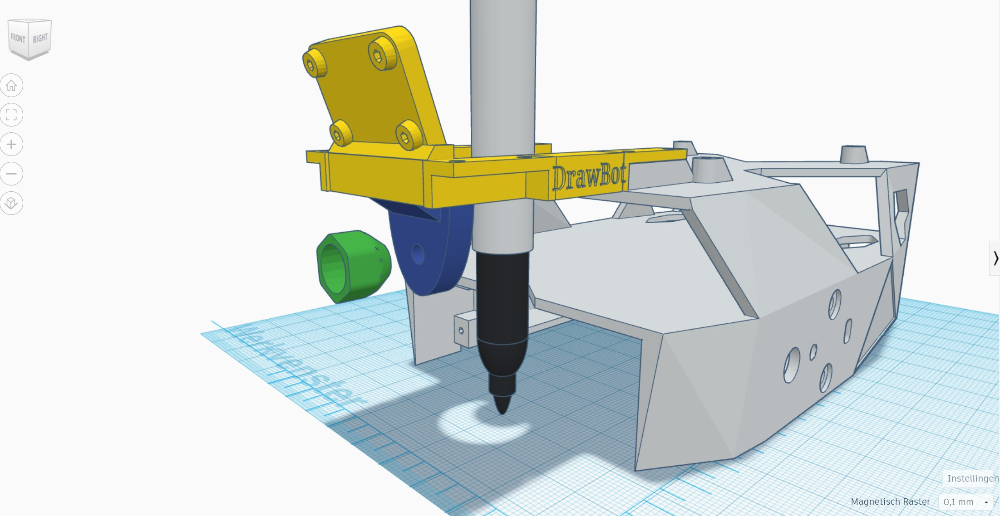

All we had to do now was slice the design and print it. This process was no trouble as the program Ultimaker Cura created all the supports. One little mishap we noticed when the print was done was that we had placed the two legs the wrong way around so the program made printing supports on the outside. This turned out pretty ugly so we might change that later. You can click the black play button for a video.

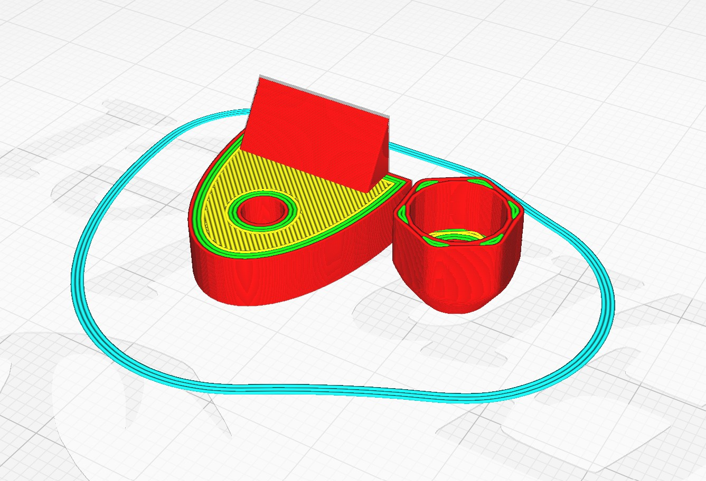{width=450}
[{width=350}](../videos/PenHolderV1Video.mp4)

<b>And after printing and attaching it looks like this!</b> 

{width=270}
{width=270}
{width=270}

It fit perfectly! There were no gaps and the screws could slide in like they had always been there. There were however some difficulties. The hole where the big screw fits through was not big enough to thread but this was resolved with brute force. The second issue was that the supports that were made for the 3d printer were too firm and were quite hard to remove. So after they were gone it looked like this:

{width=400}

We cleaned this up by wet sanding it and after that it turned out like this:

{width=400}

### Sprint 2

For this sprint we want to change a couple of things:

- We need to be able to lift the pen off of the paper. This is going to be done with a servo.

- We need to get 4 M2 X 20 screws for the bottom of the legs, we could not find these anywhere. 

- And lastly we want to adjust the angle of the camera so it points more downward.

We started with adjusting the angle of the camera by loading the existing design in a new tinkercad file. Then we started to look around the design for how we could make the camera point down more. Soon we came up with a system where the camera could rotate so we could change the angle whenever we wanted to. This is what we came up with:

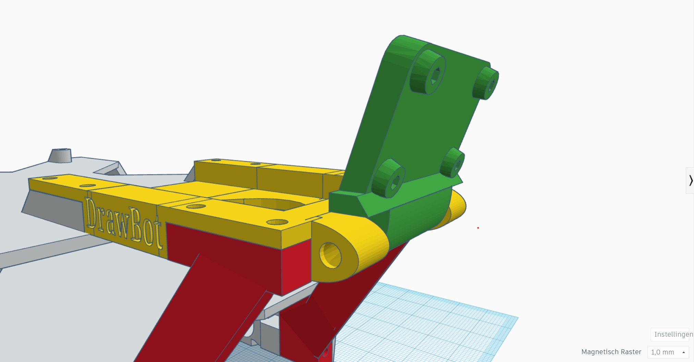{width=800}

The idea is that there would be a bolt and a nut going through the holes. Once this is tightened the yellow part will clamp the green part holding the camera steady. We have not been able to test it as it is not done printing while this is being written. (Update: the model is done printing and it turned out pretty good. The only thing we had to do was make the holes a little bit bigger because the bolt would not slide through easily.)

After this was done we had to find a way to lift the pen off of the paper with a servo. We got inspiration from [this](https://youtu.be/tF2mantrnuI) video where the pen is in a seperate box. The box is on guides and is being pushed up by the servo and pushed down by springs. After some tinkering in Tinkercad it turned out like this: 

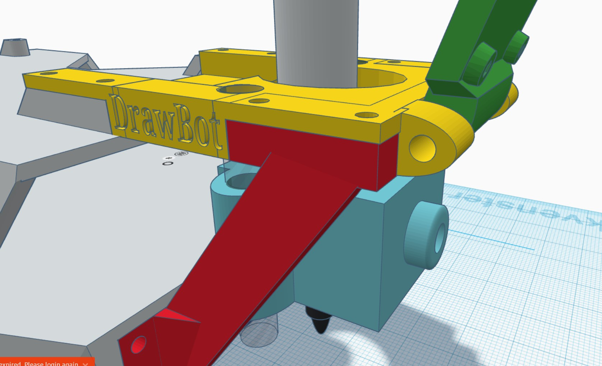{width=400}
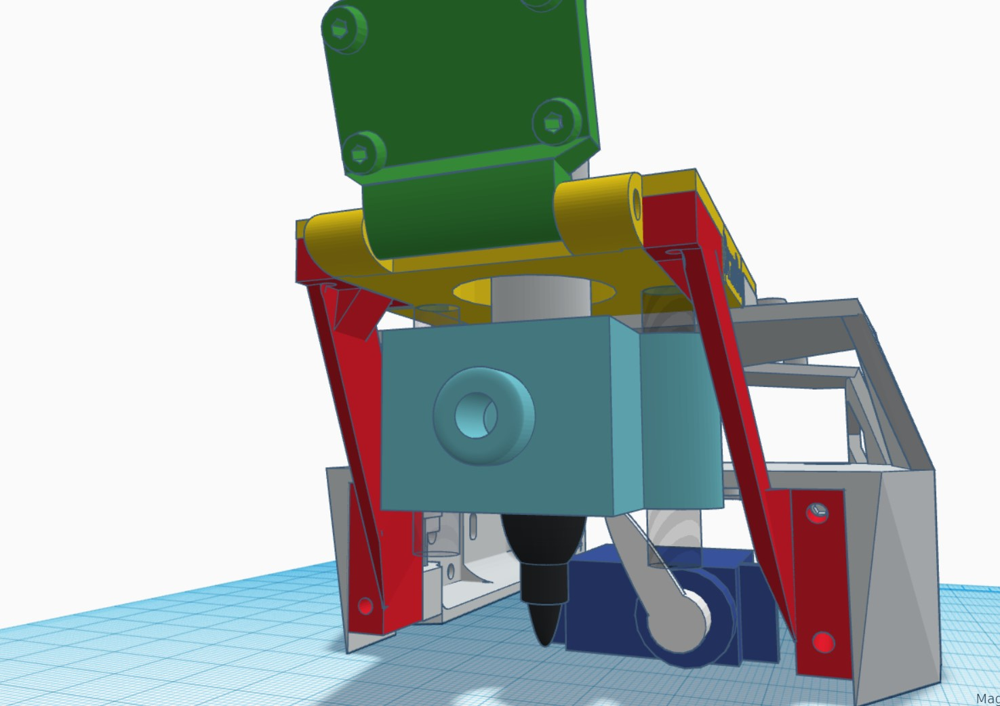{width=400}

The hole in the front of the light blue part is for an M5 bolt to clamp the pen in place. Just with the old design this part has a triangular hole so there is no limitation in what type of pen it fits. On the side of the blue parts there are two holes that are slightly bigger than an M6 bolt so that it can slide up and down. The bolts attach on the yellow part where we are going to tap the holes. If everything is sized properly the arm of the servo should just about hit the sliding part. 

After making this we had to find a way to attach the servo and the chip to control it. So we took another look at the existing JetBot and discovered 4 existing holes at the bottom. We used those to create a floor where the chip and servo could be attached. After designing it looked like this: 

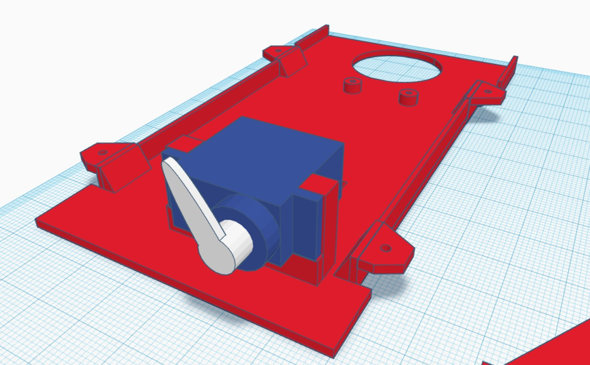{width=800}

The floor is lower than the bottom of the JetBot because the chip we want to use is quite tall and when that is attached it hits the other chip that controls the motors. The servo uses its own mounting points.
