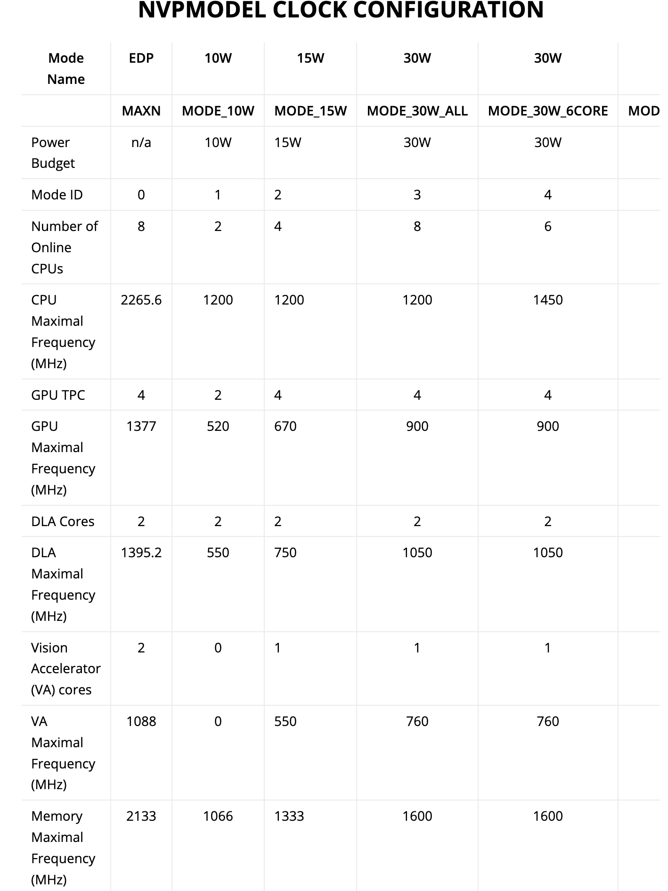

# Power issue

When loaded the Tensorflow model onto Jetson nano, we faced some troubles as not getting the Drawbot moving and
simultaneously recognizing shapes. That was due to the defeault configuration that the Jetson Nano uses, which resulted
in shutting down the Jetbot when loading the trained model.

Jetson systems are available in a variety of performance and power configurations. Most product development cycles
include balancing performance and power needs. Fortunately, NVIDIA has done the legwork and calculations to determine
which processing components deliver the optimum performance for a given energy budget in numerous combinations. At the
very least, these setups are an excellent place to start when creating your own tailored configuration.

Nvpmodel specifies the number of CPUs and their clock rates, as well as the GPU frequency and the External Memory
Controller (EMC) frequency. Keep in mind that the EMC regulates the speed of access to the external LPDDR4 memory.

The Jetson nano provides a far more robust computing environment than the Jetson TX2. The Xavier incorporates Deep
Learning Accelerators (DLA) and Visual Accelerators (VA) in addition to 4 additional CPU cores (VA). These new features
may also be customized using nvpmodel! nvpmodel defines four distinct power envelopes in seven distinct modes. The power
envelopes are 10 Watt, 15 Watt, 30 Watt, and "Forget power utilization, speed is what I need!".

The following table shows the seven different “modes” on the Jetson boards (it might differ for each board). The
following table breaks down the modes which describe which CPU, GPU, DLA and VA cores to use along with their clock
frequency, and the memory controller frequency.
<br>



In short the following commands can be applied on the Jetson nano to reduce the power consumption among other things:

To call nvpmodel:

```bash
sudo nvpmodel -m [mode]
```

where mode is the number of the mode that you want to use. For example:

```bash
sudo nvpmodel -m 0
```

You can query which mode is currently being used:

```bash
sudo nvpmodel -q –verbose
```

In our case we have to set the Jetson power mode on 1, which uses 5 Watt.

```bash
sudo nvpmodel -m 1
```

Confirm the that the mode has been set to 5 Watt by executing the following command

```bash
sudo nvpmodel -q
```


