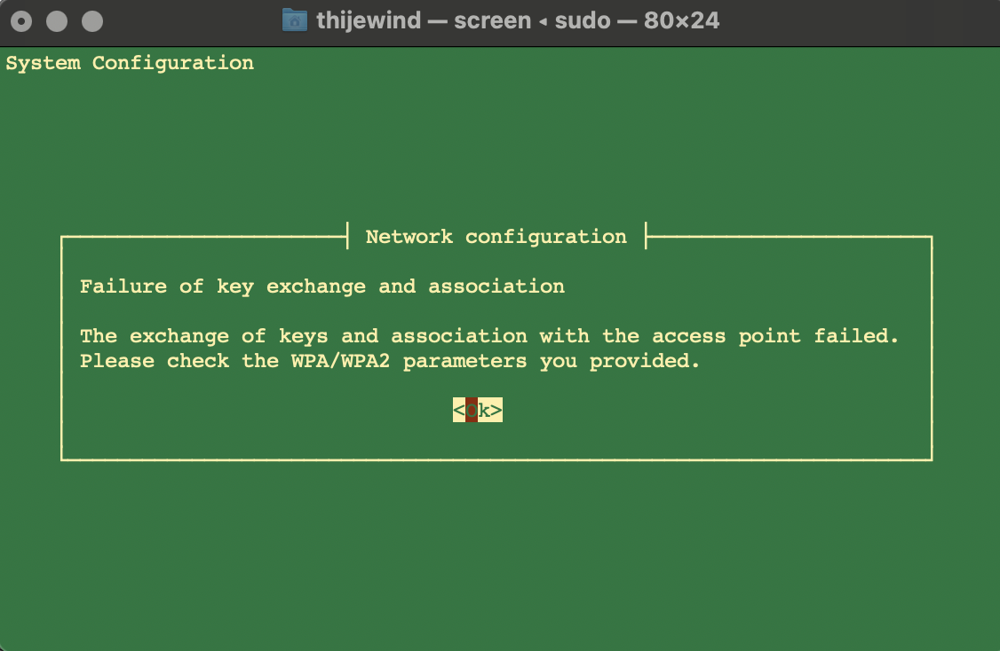
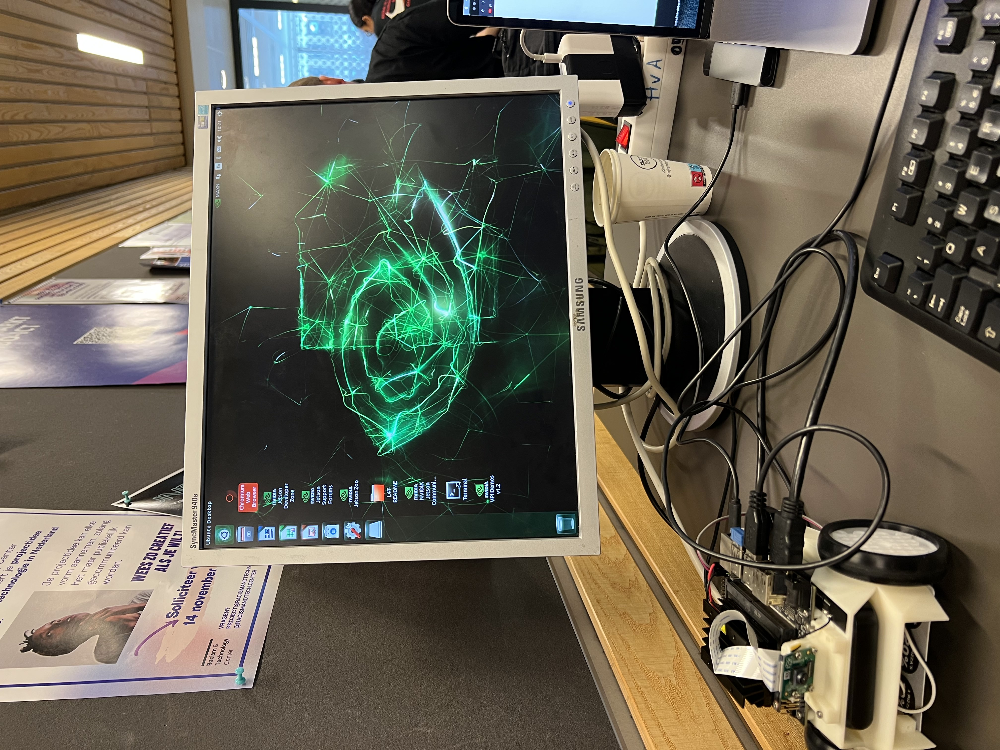

# How to clean install the Jetson Nano board

For this guide I followed the [setup documentation](https://developer.nvidia.com/embedded/learn/get-started-jetson-nano-devkit#intro) from Nvidia. 

1. We start off with downloading the [Jetson Nano SD card image](https://developer.nvidia.com/jetson-nano-sd-card-image).
2. We have to write the image to the sd card, we are going to use [Etcher](https://www.balena.io/etcher/) for that.
3. Plug the SD into the Jetson and connect it with your computer. 
4. After that you're going to open up the terminal and start the installation process follow the step on the [setup documentation](https://developer.nvidia.com/embedded/learn/get-started-jetson-nano-devkit#intro) from Nvidia. 

I got stuck at the network configuration and couldn't get it to work. The Jetbot just kept giving error messages. 

After trying for like 3 times I decided I was going to use the other installation method. The setup with a display atteched to the Jetson Nano. This makes the installation process a bit easier since you don't have to do everything from the terminal. 

The Jetbot is working! 

