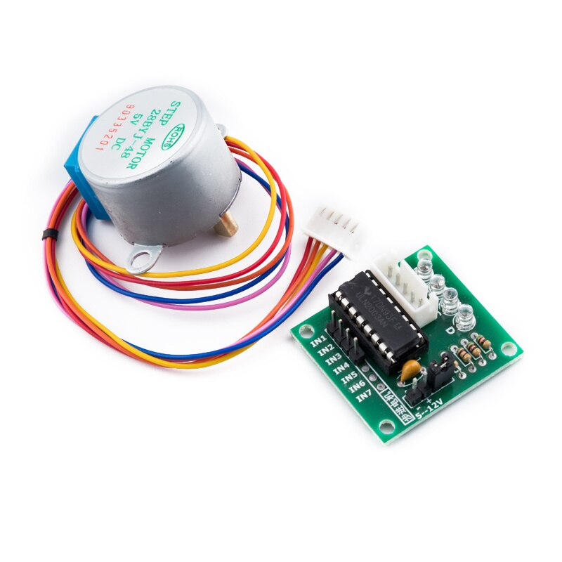

# Stepper Motors on the Jetson Nano 

## DC Motors vs Stepper Motors

### DC Motors

DC motors are electrical motors that move depending on the polarity of the magnets inside them. The polarity is determined by the the current that is flowing through it and the direction of the current. 

As you can see in the animation above, the inside is covered in coils that change polarity depending on the direction of the current running through them and the outside are 2 magnets that repel/attract the magnets depending on their polarity. 

The fact that the DC motors can only be set on or off also means that they are hard to stop on a set point and thus hard to use for accurate movements. This fact is of importance to our project since we need accuracy to draw using the Drawbot. 

The video below goes more in depth on how electric motors work if you want to learn more. 

<iframe width="480" height="270" 
src="https://www.youtube.com/embed/CWulQ1ZSE3c" 
title="YouTube video player" frameborder="0" allow="accelerometer;
autoplay; clipboard-write; encrypted-media; gyroscope; picture-in-picture" allowfullscreen></iframe>

### Stepper Motors

Stepper motors work in principle the same as the DC motors. The main difference between the two is that DC motors have the coils mainly on the inside and the change in polarity happens in those coils to spin. While with the stepper motors the object with the set polarity is in the middle and the coils are on the outside ring. 

As you can see in the example animation above the disk in the middle which is called the rotor gets spun around by changing the polarity of the motor which is called a stator. 

As shown here the rotor has more than polarity. The disk in the middle is split into pieces with different polaritys and by changing the polarity of the stator you can make the rotor spin step by step hence a stepper motor. Depends on how many times you split the rotor you can make it move smaller and smaller steps and hence get it more accurate. So for example with a stepper motor that needs 200 steps to make a full rotation you can determine that the accuracy of each step is 360 degrees/200 steps = 1.8 degrees per step. So with a stepper motor with 400 steps it would be 0.9 degrees per step.

This is the inside of a physical stepper motor for demonstration. 

For more info on how stepper motors work you can watch the video below.

<iframe width="480" height="270" 
src="https://www.youtube.com/embed/VfqYN1eG9Zk" 
title="YouTube video player" frameborder="0" allow="accelerometer;
autoplay; clipboard-write; encrypted-media; gyroscope; picture-in-picture" allowfullscreen></iframe>

### The pros and cons

__DC Motors__ are more useful for applications where the only goal is for the motor to keep spinning without an emphasis on accuracy. Take for a example dc motors in electric tooth brushes or fans. So their pro is that they can be turned on and they will keep spinning as long as power is provided. The con in this case is accuracy since they don't have a way to measure how far they spun like stepper motors do.

__Stepper Motors__ are more useful for precise applications. For example printers, 3D printers and the autofocus and zoom mechanisms in digital or phone cameras. The cons for stepper motors is that they are more complicated to use and that they are in general slower than normal dc motors.

### Why stepper motors are better for the Drawbot

In conclusion since stepper motors are able to move step by step while dc motors are only able to move on or off this means that stepper motors are way more accurate than normal dc motors. For our drawbot we want to be able to draw shapes and for that we need the robot to rotate in precise angles and that is not physically possible using just dc motors. So in conclusion we need stepper motors to get the drawbot to draw more accurately. 

## Kinds of stepper motors 

There are many kinds of stepper motors. Some with different sizes and some with more or less accuracy depending on the how many steps they take for a full rotation as explained above. For this project we would use the 28BYJ-48 stepper motor and ULN2003 driver board. 

These is one of the smaller stepper motors that you can buy and while being pretty cheap it should get the job done. 

## Connect Stepper Motor to Jetson

## Examples using an Arduino

While I was researching this I found two pretty encompassing guides that might be useful so I decided to share them below.

<iframe width="480" height="270" 
src="https://www.youtube.com/embed/CEz1EeDlpbs" 
title="YouTube video player" frameborder="0" allow="accelerometer;
autoplay; clipboard-write; encrypted-media; gyroscope; picture-in-picture" allowfullscreen></iframe>

<iframe width="480" height="270" 
src="https://www.youtube.com/embed/avrdDZD7qEQ" 
title="YouTube video player" frameborder="0" allow="accelerometer;
autoplay; clipboard-write; encrypted-media; gyroscope; picture-in-picture" allowfullscreen></iframe>

### Connecting stepper motor directly to Jetson

We researched ways to connect the Jetson directly to a stepper motor but non seemed to work for our use case and the biggest problem was that we would need to make use of the PWM pins on the Jetson which as mentioned in our [Jetson to servo documentation](../documentation/control_servo_on_jetson.md) we couldn't get to work previously with our current OS. 

### Using adafruit feather motor driver 

We can use the [adafruit stepper dc motor featherwing](https://learn.adafruit.com/adafruit-stepper-dc-motor-featherwing/downloads) 
to control the stepper motors. By using the circuit python library we can use the featherwing board to control the stepper motors. 

Using [this link](https://learn.adafruit.com/adafruit-stepper-dc-motor-featherwing/pinouts)
you can see the pin layout for the feather board. Below you can see a simplified version of the contents. 

You can follow this [adafruit guide](https://learn.adafruit.com/adafruit-stepper-dc-motor-featherwing/using-stepper-motors) 
to use a stepper motor with the featherwing on an arduino. I am using this guide mainly to figure the cabling out. 

[This is a guide](https://learn.adafruit.com/micropython-hardware-pca9685-dc-motor-and-stepper-driver/tdicola-hardware) using the 28BYJ-48 stepper motor. This guide is outdate but this is useable for inspiration and to figure out the cabling using the 28BYJ-48.

This [guide for using circuitpython with the feather board](https://learn.adafruit.com/adafruit-stepper-dc-motor-featherwing/circuitpython)
is what we are planning to use to control the stepper motors using the current drawbot setup we have using the Jetson nano. 

## Conclusion
 
If we were to try to use the Jetson nano to control the stepper motor we would go with the last method mentioned above which is using the featherwing board to control the stepper motor from the Jetson nano. We would try to get it working using the 28BYJ-48 stepper motor either directly to the board or using the ULN2003 driver board. We have to test which would work with the featherwing board. We have concluded that it is hard to know if this will work without testing and thus if we implement this into our project we will document the results and link it below. 

