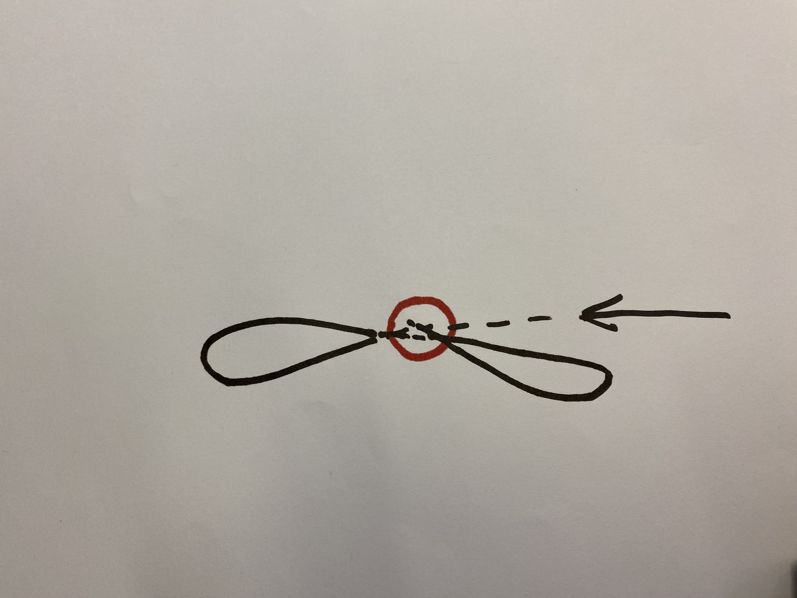

# How can the Drawbot draw a flower?

We decided that the drawbot should draw a flower once it recognizes a circle. To make this happen, we have to decide how the flower can be drawn. Because we cannot make the rotations of the wheel motor consistent, it is impossible to make a perfect drawing. We can however input some commands which should represent a cool looking flower shape.

## Single leaf drawing

The drawbot is able to draw a single leaf of the flower. In the sketch below we have an example of this.



The drawbot detects the circle and starts the first leaf. It makes a small curve. When it has reaches a few centimeters, it turns quickly. Then, it makes another curved turn, resulting in the full leaf. Because the angle in which it turned is around 30 degrees, it can repeat this process 360/30, which is 12 times to make a full flower.

Doing it this way, we can program the Drawbot to check for new interpretations after each leaf is drawn.

### Drawbot code to draw a leaf

We have created 3 demo's of a circle. Because our motors are not consistent, creating a perfect flower is impossible. The source code can be found here:

```python
def drawSunflowerLeaf(self):
    INITIAL_SPEED = 0.4
    TIMEOUT = 0.25

    self.robot.forward(INITIAL_SPEED)
    sleep(TIMEOUT)

    self.robot.backward(INITIAL_SPEED)
    sleep(TIMEOUT)

    self.robot.left(INITIAL_SPEED)
    sleep(TIMEOUT)

    self.robot.stop()

def drawLeaf(self):
    INITIAL_SPEED = 0.6
    LEAVE_CURVE_TIMEOUT = 0.5
    TIMEOUT_TURN = 2.5
    SLOW_SPEED = INITIAL_SPEED * 0.3

    # Curve forward
    self.robot.set_motors(SLOW_SPEED, INITIAL_SPEED * 0.8)
    sleep(LEAVE_CURVE_TIMEOUT)

    self.setPenUp()
    self.robot.stop()
    sleep(2)

    # Turn
    self.robot.set_motors(0, INITIAL_SPEED)
    sleep(LEAVE_CURVE_TIMEOUT)
    self.robot.set_motors(-INITIAL_SPEED, 0)
    sleep(LEAVE_CURVE_TIMEOUT)

    self.setPenDown()
    self.robot.stop()
    sleep(2)

    # Curve forward
    self.robot.set_motors(SLOW_SPEED, INITIAL_SPEED * 0.8)
    sleep(LEAVE_CURVE_TIMEOUT)

    self.robot.stop()
        
def drawTurnLeafLeaf(self):
    INITIAL_SPEED = 0.6
    LEAVE_CURVE_TIMEOUT = 0.5
    TIMEOUT_TURN = 2.5
    SLOW_SPEED = INITIAL_SPEED * 0.3

    # Quick turn
    self.robot.set_motors(0, INITIAL_SPEED)
    sleep(LEAVE_CURVE_TIMEOUT)

    self.robot.set_motors(-INITIAL_SPEED, 0)
    sleep(LEAVE_CURVE_TIMEOUT)

    self.robot.stop()
```
