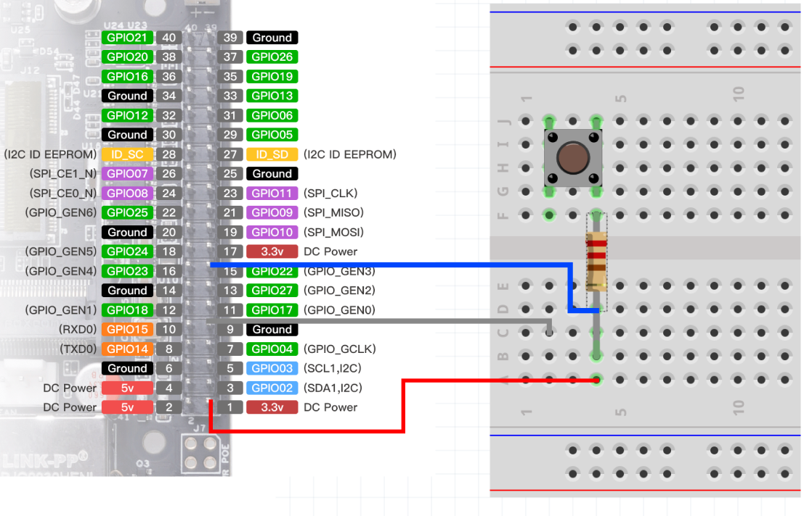
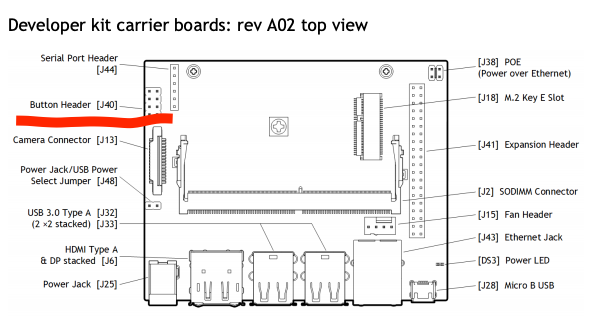
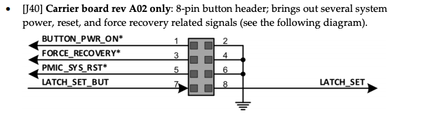

# How to add a button to the Jetbot Nano

First we are going to connect the button and wires to the JetBot like so .

To test if the button is connected correctly we are going to open up the terminal. Run the following commands 1 by 1.

```cmd
python3
```
```cmd
import RPi.GPIO as GPIO
```
```
GPIO.setmode(GPIO.BOARD)
```
```cmd
GPIO.setup(15,GPIO.IN)
```
```cmd
x=GPIO.input(15)
```
```cmd
x
```
The output should be 1.

Now if you press the button and execute the x=GPIO.input(15) command again, the output should be 0.

When exiting the terminal make sure to use the following command.
```cmd
GPIO.cleanup()
```
This cleans all the pins, if you don't do this the gpio pin stays locked up.

Now that we know that our button works we are going to open up a new python file. 
```python
import RPi.GPIO as GPIO
GPIO.setmode(GPIO.BOARD)
inPin=15
GPIO.setup(inPin,15,IN)
while True:
    x=GPIO.input(inPin)
    print(x)
```
Now we can read out the pin and the button is connected! 

I used the following [tutorial](https://www.youtube.com/watch?v=ehzrPl5cNCc) to set up the button.

## Errors
While trying to run the command ``import RPi.GPIO as GPIO`` I found out that I needed to install the RPi module. To install the RPi module I first had to install pip. I had a lot of problems trying to install the library and couldn't get it to work. 


# How to use a button to turn the Jetbot on or off


On your Jetson Nano, you have to find the header pins they are located here: 


Here you can see what the pins do:


1. First you have to use a jumper wire to prevent the Jetson Nano from auto powering on after you plug the cable in.
2. After that you can connect a button to pins 1 and 2. After shortening the pins the Jetson will power on or off.

Source for the documentation [Dots and brackets codeblog](https://codeblog.dotsandbrackets.com/power-buttons-jetson-nano/).

# Applying research to our project
After discussing with the team we decided that we didn't want the power on/off button to shut the whole Jetbot down. Instead we want to have a push button to just pause the Jetbot and stop moving. So that the Jetbot is still powered on and able to start drawing again. We came to the conclusion that a remote receiver would be a good option to pause the Jetbot.


