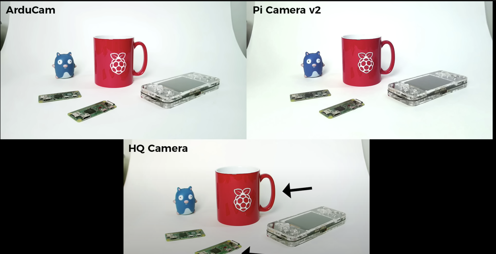

# What cameras are available for the Jetbot?

The current camera with the Jetbot is the Raspberry pi camera V2. We have experienced that the camera is having difficulties detecting colors due to change of lightning throughout the day. Hence why we are researching the available camera options for the Jetbot.

|Camera|Description|Model|MP|Price|
|:-----:|:-----:|:-----:|:-----:|:-----:|
|[Raspberry Pi v2](https://www.tinytronics.nl/shop/en/sensors/optical/cameras-and-scanners/raspberry-pi-camera-v2-8mp)|The standard camera that comes with most of the Jetbot kits.|RPICAMV2|8MP| €26.00|
|[IMX219 Camera Module, 160 degree FoV](https://www.waveshare.com/imx219-d160.htm)|A camera module for the standard raspberry pi v2 camera. The module epxands the FoV to 160 degrees.|IMX219-D160|-|$12.99|
|[Arducam 12MP IMX477 Mini High Quality Camera Module for Raspberry Pi](https://www.sossolutions.nl/arducam-12mp-imx477-mini-high-quality-camera-module-for-raspberry-pi)|A high quality upgrade to the Raspberry Pi v2. You can also switch out the lenses of the IMX477 camera.|IMX477|12,3|€94,95|
|[16MP IMX519 Autofocus Camera Module for Raspberry Pi](https://thepihut.com/products/arducam-imx519-autofocus-camera-module-for-raspberry-pi)| A cheap upgrade from the raspberry pi v2 with autofocus build in and higher MegaPixels.|IMX519|16|£24|

----
After researching the available camera options for the Jetson our best option would be the [16MP IMX519](https://thepihut.com/products/arducam-imx519-autofocus-camera-module-for-raspberry-pi). This camera is a noticeable upgrade from the [Raspberry Pi v2](https://www.tinytronics.nl/shop/en/sensors/optical/cameras-and-scanners/raspberry-pi-camera-v2-8mp) and because of the price this would be the most logical upgrade. The [12MP IMX477 ](https://www.sossolutions.nl/arducam-12mp-imx477-mini-high-quality-camera-module-for-raspberry-pi) would be the best available option if you want the highest quality but in my opinion that would be overkill in our project. Because the camera is pretty expensive and we don't need the option to switch out multiple lenses. All we need is a good quality camera that can detect lines, shapes and colors. Below you'll find a screenshot comparing the 3 different cameras. 

Source for the comparing image and research on the cameras [Jeff Geerling](https://www.youtube.com/watch?v=j2S8sZoH36Y).

