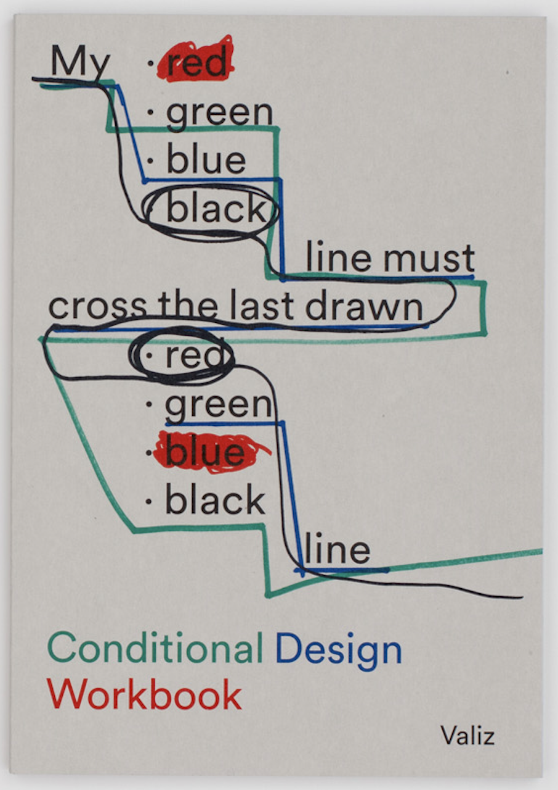
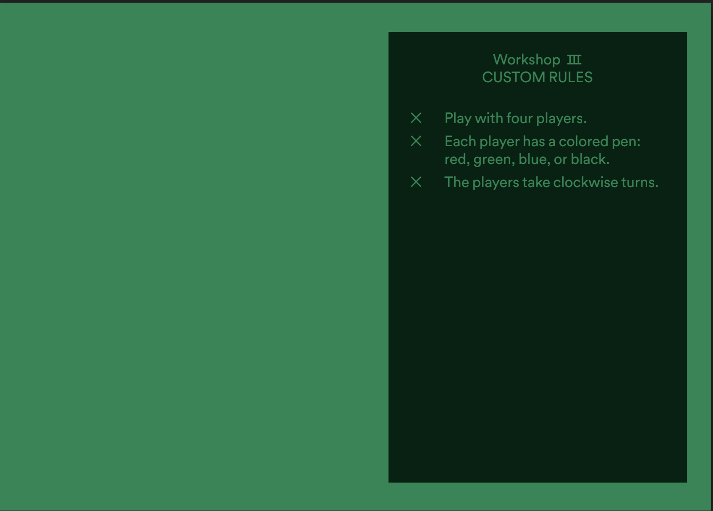
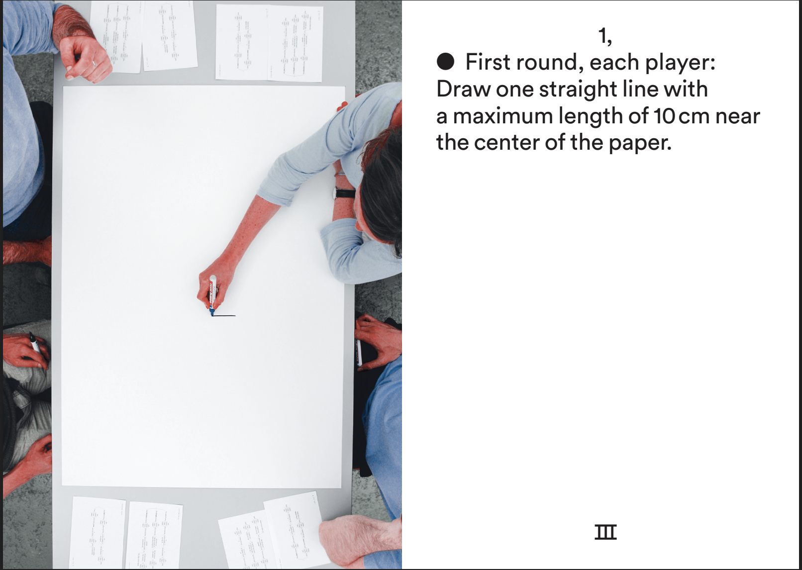
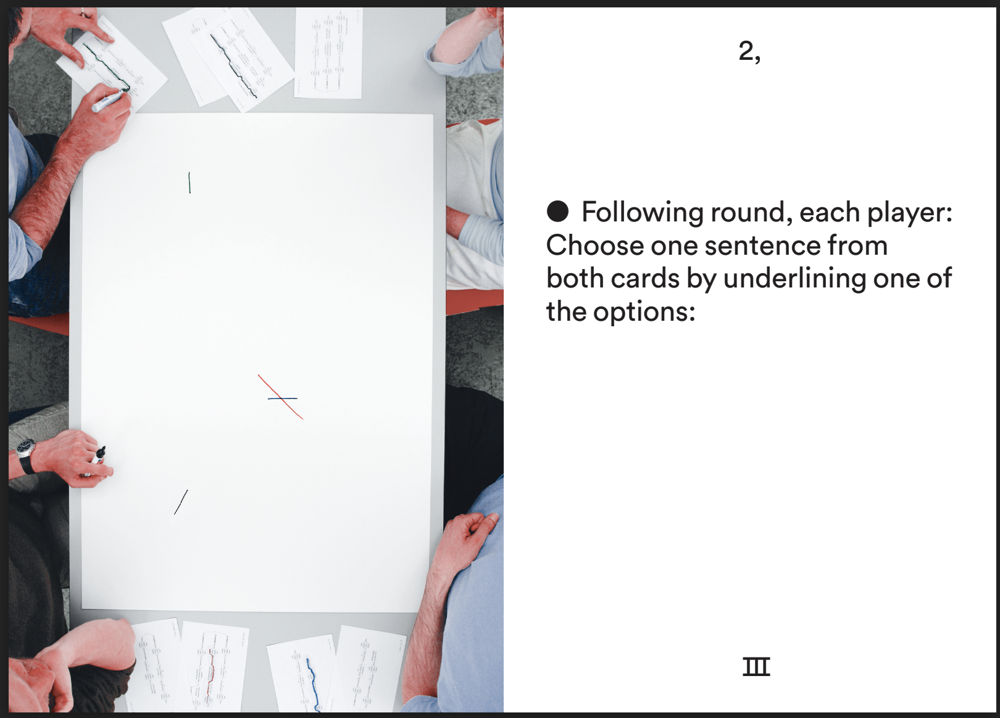
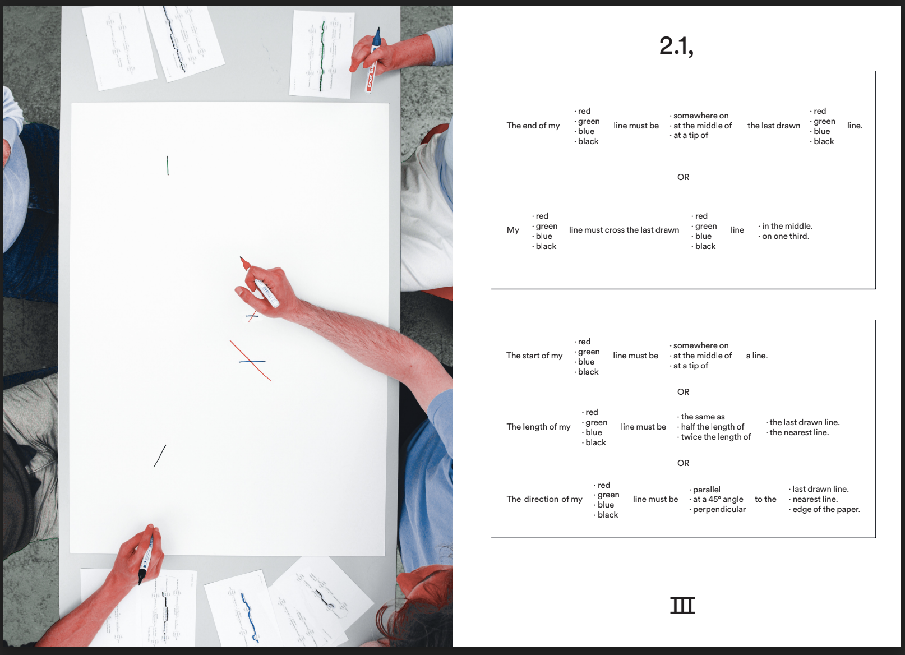
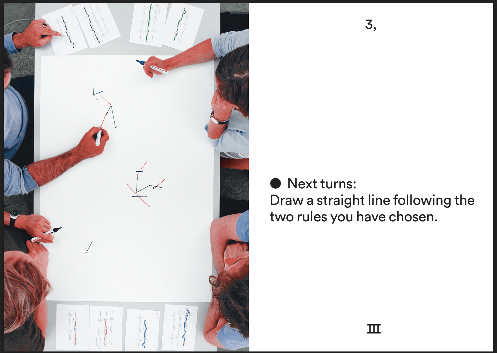
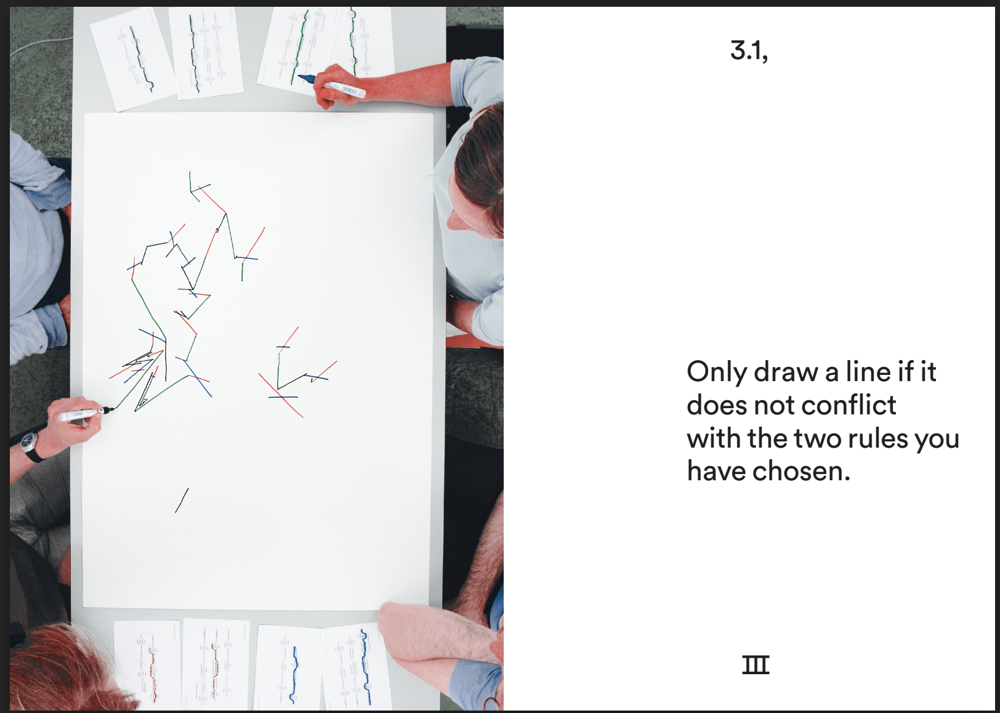
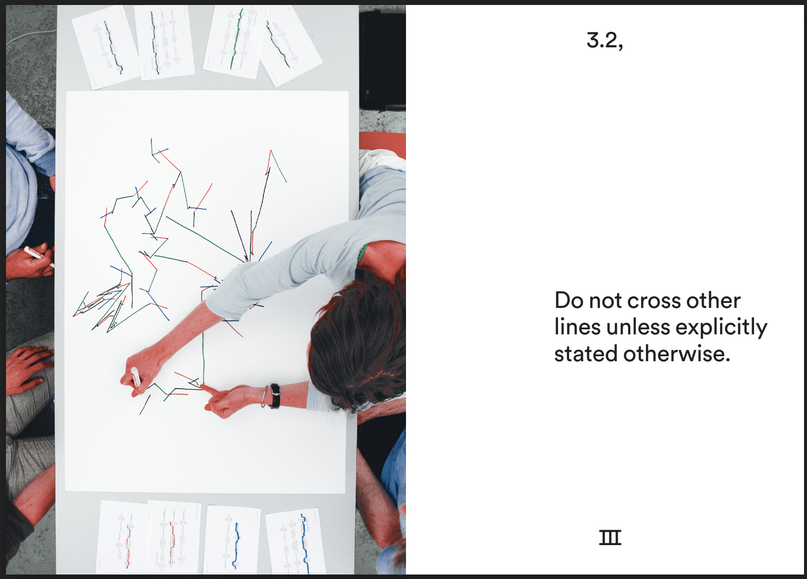
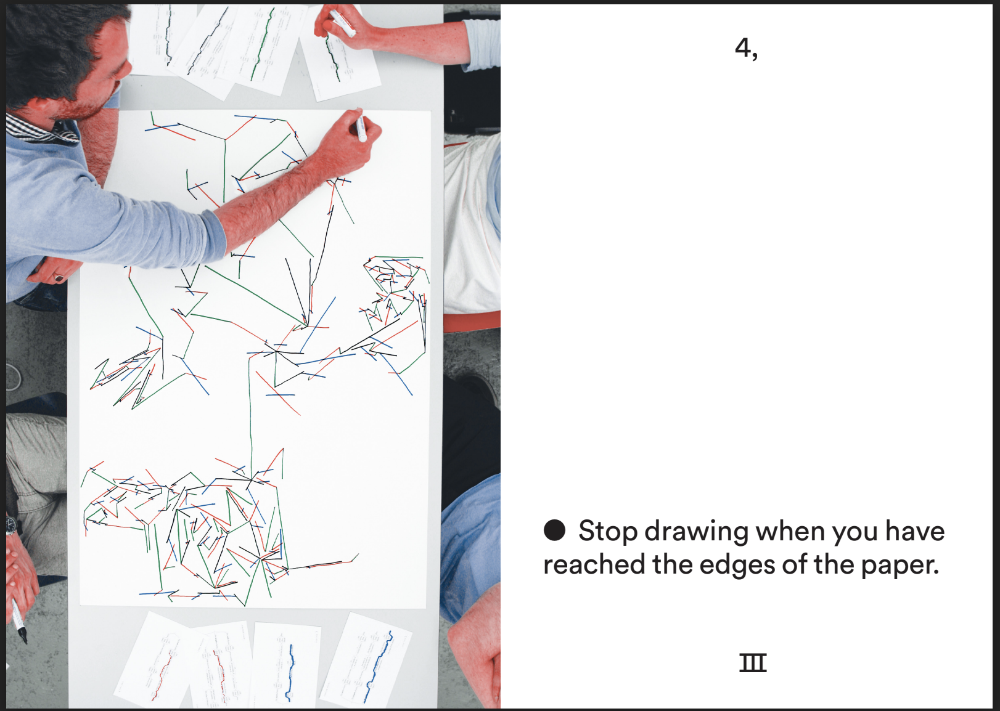

# What is conditional desgin? 

"Conditional Design is a design method formulated by the graphic designers Luna Maurer, Jonathan Puckey, Roel Wouters and the artist Edo Paulus, in which conditions and rules of play are drawn up that invite cooperation within a ‘regulated’ process towards an unpredictable design or result. The book Conditional Design sets out to provide insight into the method in an exciting way and to invite others to apply the method themselves. Conditional Design plays with chance, frameworks and generative systems and is a 'play' method that provides possibilities for every creative person. The system is surprisingly simple, and allows every team to set their own rules. The book functions as a workbook; the designer Julia Born has organized the material step-by-step, and shows in Conditional Design Workbook just how this exciting process works."(Conditional Design - Conditional Design Workbook, n.d.)

So to put this in my own words, conditional design is about working together with rules and other people or robots? I think this book is very interesting for us to see what we can do with the Drawbot. If we can make the Drawbot react to certain colors and set rules for the player. The Drawbot and the player would be creating a unique design every time they play the game. 

## An example what a game of conditional desgin would look like
There a many more examples in the [Conditional design workbook](https://drive.google.com/file/d/1iAItmp1dUeC13vGlkwd-HNL-QiJKQt5D/view) but this one seemed the most fitting for the Drawbot.

### Resources for this research
[Conditional design website](https://conditionaldesign.org/)

