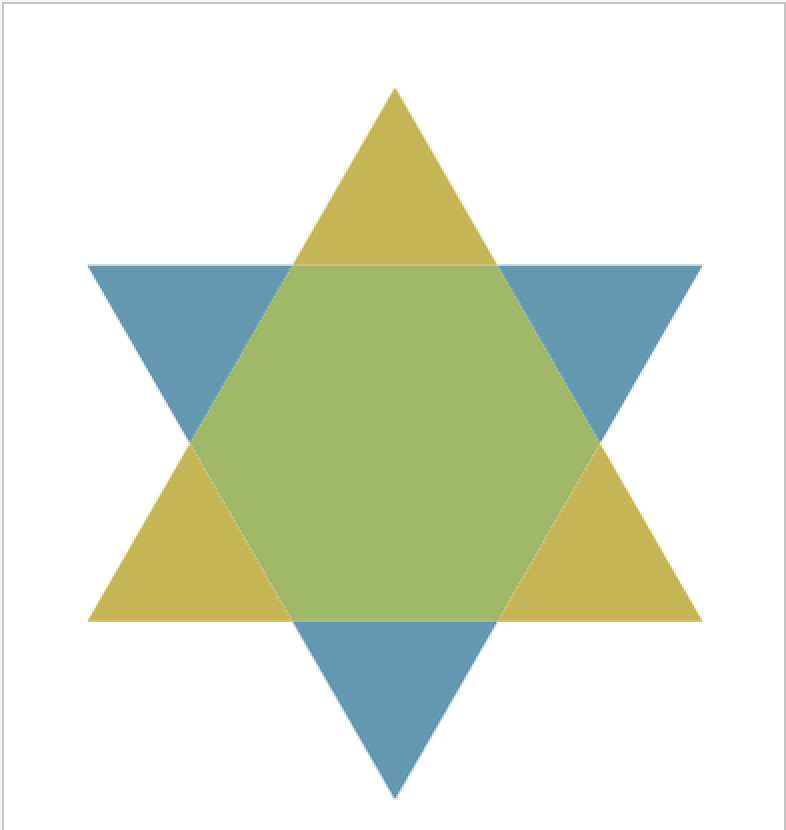
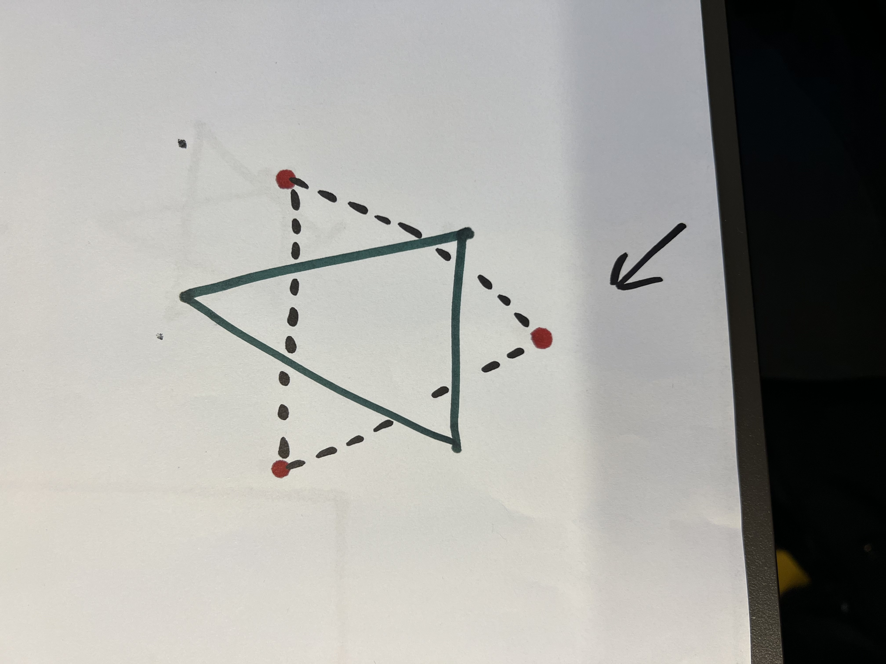

# What can we draw when the drawbot detects a triangle?

As a first step I think it would be a good idea to draw a star out of a triangle. To make a star out of a triangle you just have to draw another triangle inside of the already existing one. 

The way our Drawbot should draw the triangle is displayed in the drawing below.  The dotted lines are displaying the lines the drawbot should draw. So it has to make 3 different  lines, start at the first red dot and move to the next one.

# How to draw a triangle with the drawbot

```python
from jetbot import Robot
import time
# Init the drawbot
drawbot = Robot()

INITIAL_SPEED = 0.6
LEAVE_CURVE_TIMEOUT = 0.3
TIMEOUT_TURN = 2.5
# First we let the drawbot draw a straight line
def drawTriangle(drawbot):
    SLOW_SPEED = INITIAL_SPEED * 0.6

    print(SLOW_SPEED)
    
    # Curve forward
    drawbot.forward(SLOW_SPEED)
    time.sleep(LEAVE_CURVE_TIMEOUT)

#     # Quick turn
    drawbot.set_motors(0, INITIAL_SPEED)
    time.sleep(LEAVE_CURVE_TIMEOUT)
    
    drawbot.set_motors(-INITIAL_SPEED, 0)
    time.sleep(LEAVE_CURVE_TIMEOUT)

#     # Curve forward
#     drawbot.forward(SLOW_SPEED)
#     time.sleep(LEAVE_CURVE_TIMEOUT)
    
    drawbot.stop()
```
For now we can draw a triangle with the drawbot, it's going to be pretty hard to draw the triangle on top of the other triangle to make a star. This is something we can try to do in future sprints. 