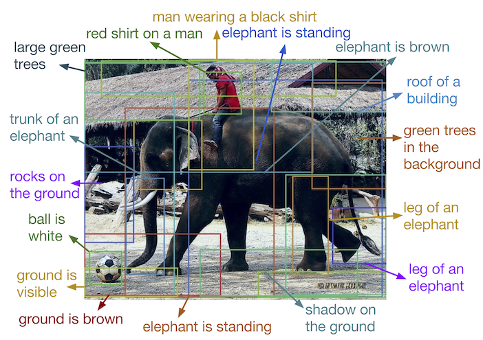

# What is Computer Vision?

On this research page I will explain Computer Vision. First of all I will begin by explaining what Computer Vision is and how it is different from machine learning.

Computer Vision is a method a computer can use to gain high level understanding from digial images or videos. If a computer is set up to use Computer Vision it can understand and automate tasks that a human eye can do. Computer Vision tasks include methods for acquiring, processing, analyzing and understanding digital images. It can do this by extracting data from an image created by the camera in order to produce numerical or symbolic information. In the image below you can see what a computer using CV sees in an image.

{width=500}

With this information a computer can execute multiple tasks. Some of those tasks include recognition, motion analysis, scene reconstrution and image restoration. Your smartphone camera also uses Computer Vision to scan a QR-code.

The difference between CV and machine learning is that CV attemps to train computers to recognize patterns in visual data in a similair way humans do. On the other hand machine learning enables computers to learn how to process and react to data inputs based on criteria set by previous actions. Machine learning is more general and does not necessarily involve visual data.

