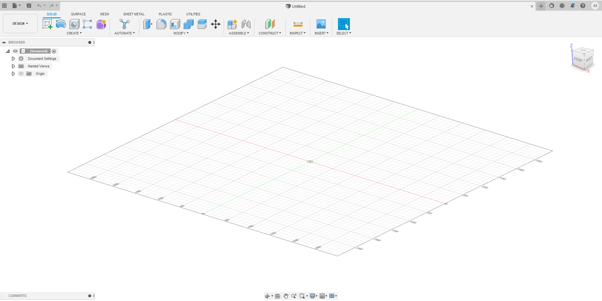
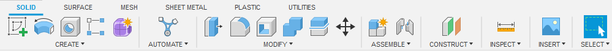
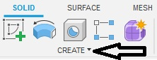
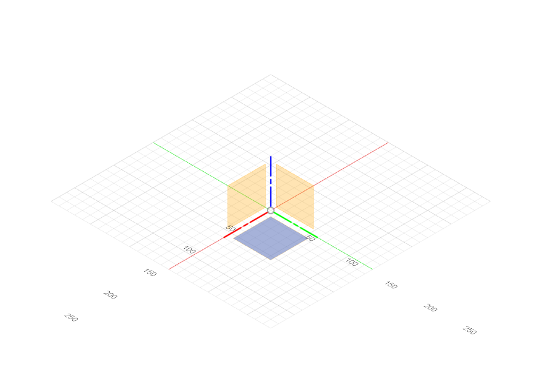
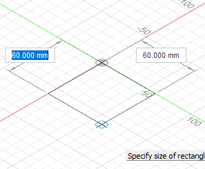
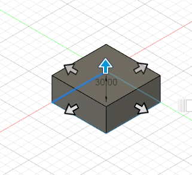

# How to get Fusion360

## How to install

First of all you need to log in using your HvA account. If you go to your account on the top right and click on it, you will get a dropdown menu. From the menu under the category account click on products and services. From there you should be able to download fusion360 among the available options. 

# The basics

Once you open Fusion360 you will be presented with the following screen. 

First of all lets look at the bottom of the screen. You will see the following toolbar. 

This toolbar is for controlling what your mouse does. For example the first option in the toolbar is the orbit tool. It lets you control the rotation of the project using your cursor. Another way to control the rotation of the project is using the rotation box on the top right. 

### Different model types
Next lets look at the top. 

First you will see solid, surface and mesh etc. 

The main basic ones are solid, surface, mesh and form. 

Solid and surface are both used to create normal basic shapes but the main difference is that solid objects are filled while surface objects are hollow.
Mesh is essentially any imported 3d material. For example importing someone else's project, it would then be put into the project as a mesh. 
Form is what is used to create weird objects with very curvy form, and it offers a lot of flexibility in its design. 
For more information on the different types of models you can watch the following video which goes more in depth. 

<iframe width="560" height="315" src="https://www.youtube.com/embed/DiBJt318VIc" title="YouTube video player" frameborder="0" allow="accelerometer; autoplay; clipboard-write; encrypted-media; gyroscope; picture-in-picture" allowfullscreen></iframe>

### Creating a basic object shape

Once you click on the create button you can choose a plane on which to place the object. 

Now you can choose the size of the object you want to make. 

After you place the object you will get the following screen which is self-explanatory where you just have to move the arrows to the direction you want to expand the object to. 

This is how you can create basic objects in fusion360. 

For more information below is a beginner guide video that is pretty short but has a lot of information. 

<iframe width="560" height="315" src="https://www.youtube.com/embed/9Jgty4QDtss" title="YouTube video player" frameborder="0" allow="accelerometer; autoplay; clipboard-write; encrypted-media; gyroscope; picture-in-picture" allowfullscreen></iframe>

Below is another guide on how to make holes in fusion360. This could be useful later on. 

<iframe width="560" height="315" src="https://www.youtube.com/embed/4bDNXpWQaW4" title="YouTube video player" frameborder="0" allow="accelerometer; autoplay; clipboard-write; encrypted-media; gyroscope; picture-in-picture" allowfullscreen></iframe>

