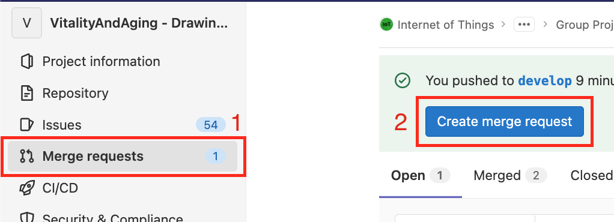
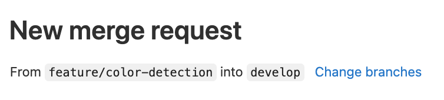
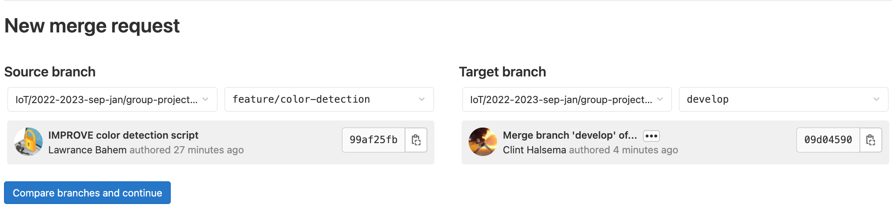
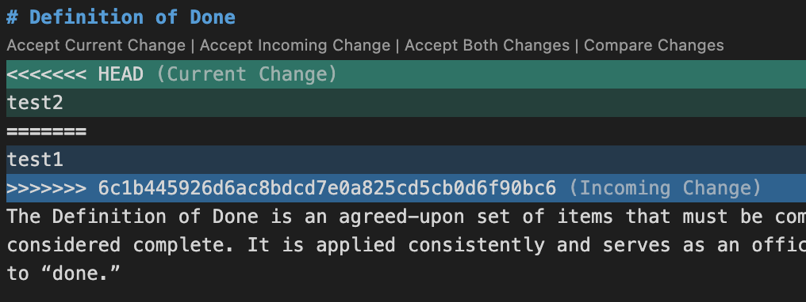

# Git Tutorial

## 1. Start working

When you start your day coding, you want to pull the incoming changes

```bash
git pull
```

## 2. Commit your changes

Once you've made some changes that work, you want to commit these changes so that they exist in the git log

```bash
# Stage the changes
git add .

# Commit the changes to the current branch
git commit -m "[YOUR-COMMIT-NAME-HERE]"
```

## 3. Push changes to GitLab

```bash
# Pull incoming changes
git pull

# Push changes
git push
```

## 4. Working on a new feature

Whenever you are going to work on a new feature or a new scrum card, you want to create a new feature branch.

First, make sure you are working on the 'develop' branch

```bash
# Switch to 'develop' branch
git checkout develop

# Pull the incoming changes from 'develop'
git pull

# Now make a feature.md branch based on 'develop'. 
# Make sure the name includes the: '/feature.md' annotation
git checkout -b "[YOUR-BRANCH-NAME]"

# Lastly, you'll want to send your feature.md branch to the server
git push --set-upstream origin "[YOUR-BRANCH-NAME]"
```

## 5. Merging my feature branch with GitLab

Done working on a feature? Here's what you do. While on the feature branch:

1. [Commit your changes](#2-commit-your-changes)

2. Update the branch with the incoming changes from 'develop'
```bash
git pull develop
```

3. Got a merge conflict? Follow [these steps](#6-resolving-merge-conflicts). Proceed to step 4

4. Go to GitLab -> 'Merge requests' and click on 'Create merge request'


5. Make sure your are merging to the correct branch, which is 'develop'.



Correct? Click: Compare branches and continue

6. Insert a suitable title

7. In the description, you'll find the definition of done. Check if your feature meets the definition of done requirements. If they do, tick them off using '- [x]'

7. Assign a reviewer. This person has to accept your merge request for it to be merged.

8. You can add a Milestone if neccesary

9. Click: 'Create merge request'

## 6. Resolving merge conflicts

If you've pulled the 'develop' branch into your feature branch, it is possible you'll get a merge conflict.
Follow the next instructions to resolve this.

1. Within VSCode, go to the file containing the conflict.

You'll see something similar to the screenshot below:


2. Solve the conflicts, then commit the Merge commit to the feature branch.

3. Now make the merge request using [these steps](#5-merging-my-feature-branch-with-gitlab)
