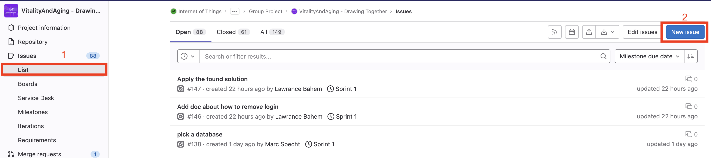
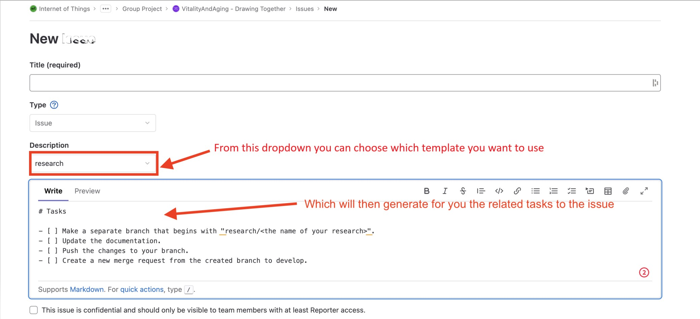
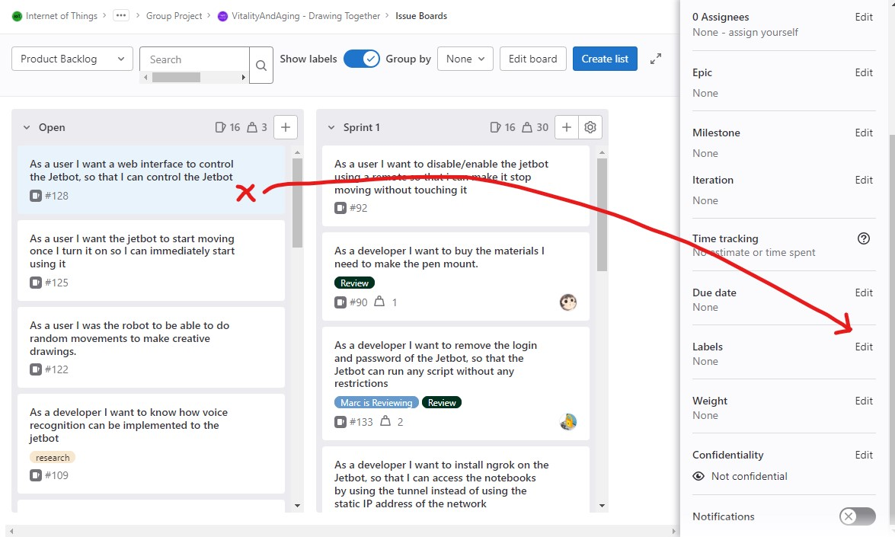
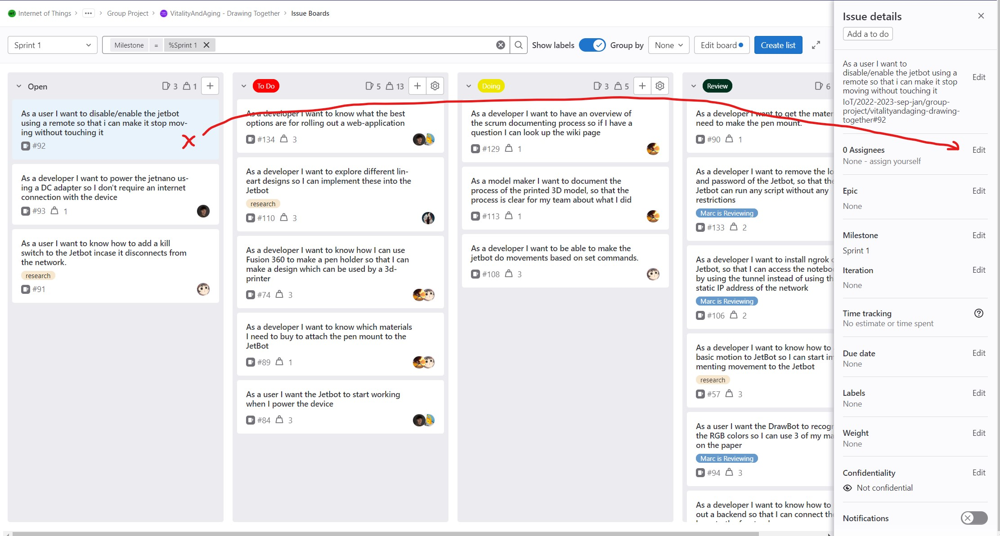
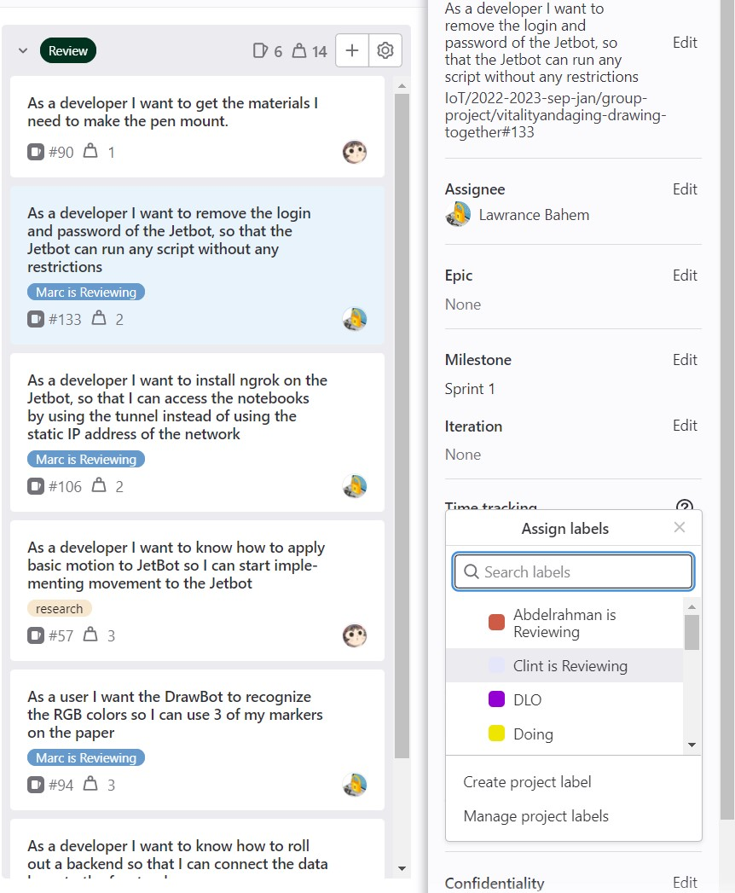
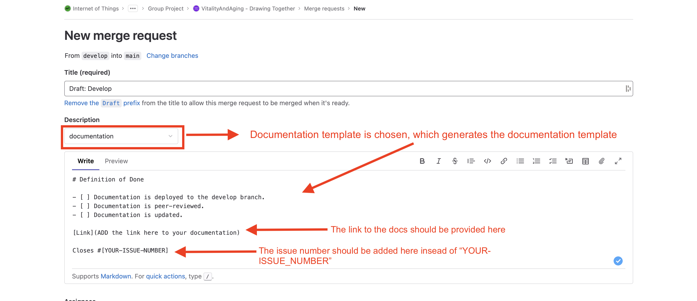
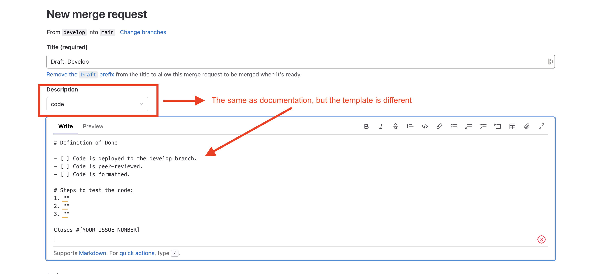

# Scrum tutorial

On this page you can find how we make use of the scrum boards.

## 1. Create a new issue
#### Add a new issue/user story
When you have a new idea or function you want to add to the project you can create a new card in the <b>"product backlog"</b>. To get here you click on the <b>Issues > List > New Issue</b> on the top right of the screen.

After that you can define whether it is a research or a feature card. 

You need to make this into a user story which means start with "as a user I want to" or "as a developer I want to" or something similair.

#### Add weight to the card 
Next you have to add a so called weight to the card. This is used to depict the workload of said card. We use numbers <b>1, 2, 3, 5 and 8</b>. If you think your card has a weight of 8 you might need to split it into smaller cards. You can determine the weights by consulting a group mate or by playing scrum poker.

#### Add a label 
If your created card is something that needs to be researched add the "research" label to it by clicking next to the text and scrolling down to "labels".

## 2. Move the issue to a sprint
When the steps above have been completed you need to take the issue card to the sprint where the work is going to be done. To do this you click next to the text again and scroll down to <b>"milestone"</b>. Then click <b>edit</b> and select the sprint.

## 3. Work on the issue
#### Assign the issue
When it is time to work on the issue you can assign it to someone or to yourself. To do this you can click next to the text again and select the option where it says "0 assignees". Here you assign the person(s) that is/are completing the issue.

#### To Do list
Once assigned you can drag the issue card into the "To Do" list. This means that the issue is going to be worked on <b>today</b> and <b>after the assignee has completed their previous issue</b>. When the latter is the case there needs to be a card with the same assignee in the "Doing" list.

#### Doing list
Is this list are all the cards that are currently being worked on. This "doing" can span multiple days depending on the weight. So you can leave the card in the "Doing" list if you continue the next day. Make sure to mention the in the standup.

#### Review list
When you have finished the issue and completed the [GIT](https://iot.dev.hihva.nl/2022-2023-sep-jan/group-project/vitalityandaging-drawing-together/git/git/) tutorial you drag the card from "Doing" to "Review" and you need to add a reviewer in the labels. The reviewer can be any of the groupmates. After that it is very important to add a link to the made work in the card so the reviewer can access it easily. This can be done by clicking on the text and adding a comment to the card.

{width=500}

## 4. Close the issue
When you are the assigned reveiwer you need to go through the work and check it for possible errors or things the creator did not see or could add. You also need to approve the merge request for the branches Develop and the branch created for the issue card.

For closing the issue, you don't need to do it manually. In the new templates for merge request, you should provide the following:

Link to the documentation (if there is any).
The issue number to have it closed once the merge request is approved by the reviewer.

Below are screenshots that show how the merge requests' templates work:

Documentation template:

 

Code template:

